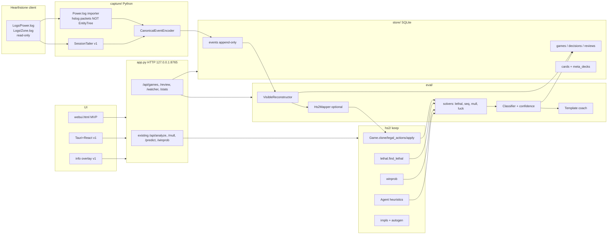
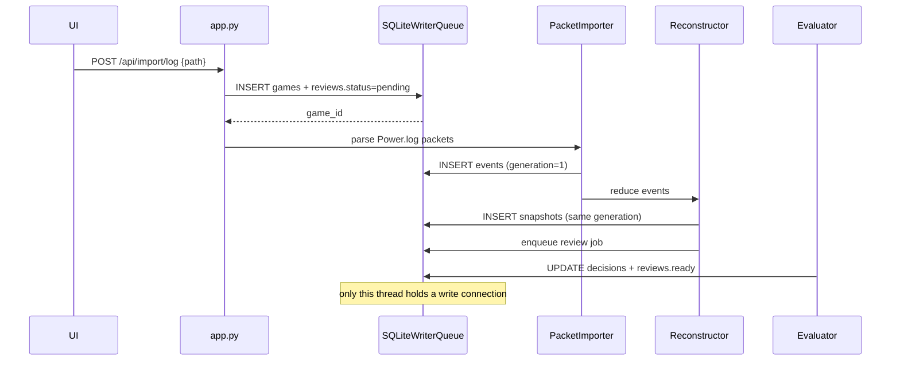
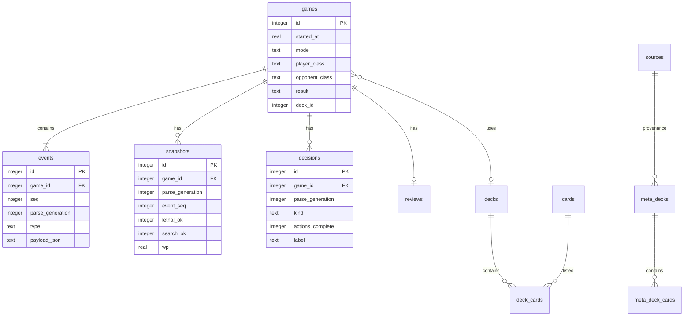
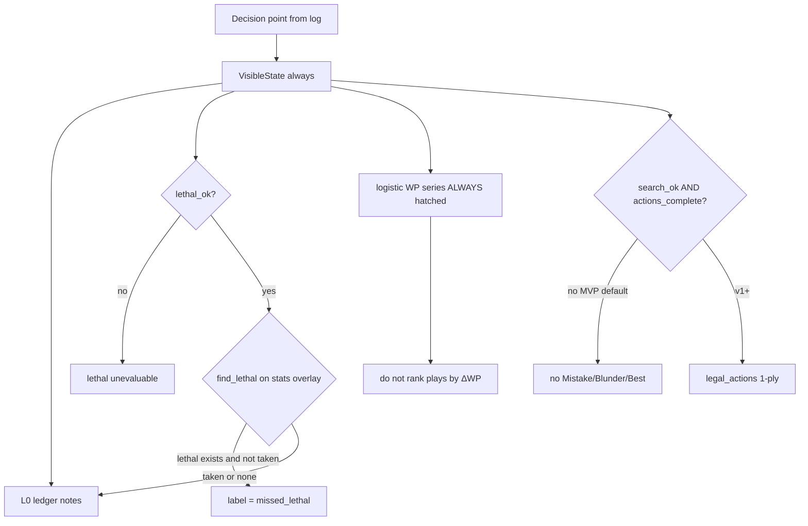
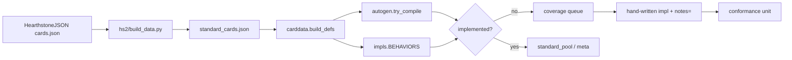

# TavernLab: Hearthstone Game Analyzer, Simulator & Coaching Platform

| Field | Value |
|---|---|
| **Document** | Product & architecture design |
| **Author** | TavernLab / hearthstone-sim |
| **Date** | 2026-08-24 |
| **Status** | Draft |
| **Codebase** | `hearthstone-sim` (Python, `hs2/` engine, `app.py` local UI) |
| **Primary user platform** | Windows 11 (developer currently Linux/Wine; macOS nice-to-have) |

---

## Executive summary

TavernLab today is a **local deck-evaluation lab**, not a game reviewer. `hs2/` simulates Standard 2026 well enough to gauntlet a fully-implemented deck (~366 games/s/core, 12 meta decks, exact-ish lethal, logistic WP with **8 board features + bias = 9 weights**, 66.7% sim-held-out accuracy), but it cannot yet reconstruct a human game, enumerate legal actions, clone state, or score a decision. Capture is split across three incompatible prototypes (`watcher.py` hslog `EntityTreeExporter` one-shot, `live.py` regex tail, `watch_turn.py` Wine-path snapshot) that write two different `games.jsonl` schemas and never produce a turn-by-turn board.

This document evolves the existing Python product into a **local-first “Chess.com Game Review + GTO Wizard for constructed Hearthstone”**: read-only log **import** (MVP) then live tail (v1), append-only SQLite event store, visible-state reconstruction, post-game review with honest confidence, and the current deck-eval/mulligan/meta tools kept as first-class tabs.

**Stack lock:** Python **3.11** for engine, evaluator, hslog importer, and local HTTP API on Win11 + macOS + Linux/Wine. Capture uses PyPI **`hearthstone` (`hslog`)** — the only maintained Power.log Packet-Tree library; we do not write a custom parser. DB is stdlib **sqlite3 (WAL)**. MVP UI is `webui.html` + PyInstaller, **bilingual en+uk from day one**; v1 shell is Tauri (Rust host, OS webview) + React/TS. Rejected: Node rewrite, Rust engine, Electron, from-scratch log parser, Postgres, numpy/torch in MVP.

Rewriting `hs2/` in Rust/C#/TypeScript is a 12+ month sink. SabberStone and Fireplace are rejected as primary engines (stale vs 2026 Standard). **Full IS-MCTS at chess-engine quality is a multi-year research program, not MVP.** MVP evaluator = **missed lethal** (stats-only hydrate, `lethal_ok`) + **turn ledger notes** + a **hatched** logistic WP chart that is **not** used to rank plays. Sequencing, luck glyphs, 1-ply ΔWP, and Brilliant/Best stay hidden until `search_ok` exists.

Legal posture is HSDT-class: logs only, overlay information-only (Windows 11 first; Wine overlay is a bonus), recommendations post-game by default, live eval behind an explicit opt-in warning (opt-in default: **full lethal line**; “hint only” is v1). No HSReplay/Untapped scraping (budget $0; ToS-sensitive). Training data is simulator self-play + the user’s own games; sim-calibrated WP **will not transfer cleanly** to humans. Solo, ~12 h/week: MVP **~200 h / ~4 months** (import-first; live tail is v1; i18n inside the window by trimming buffer), v1 ~12 months, v2 ~18–24 months. Arena/BG, cloud sync, and paid APIs are out of scope until constructed review is daily-usable.

---

## Assumptions

These are taken as given so design is not blocked. Conflicts with reality go to **Open questions**.

| ID | Assumption |
|---|---|
| A1 | Solo developer, ~12 hours/week (**~200 h to MVP** after clone/listener and import-first cuts, ~624 h to v1, ~936–1248 h to v2). 192 h does not cover a live tailer + search-grade mapper. |
| A2 | Budget for paid data/APIs: **none**. Anything that requires HSReplay Premium, Untapped paid, or a commercial LLM is **blocked/speculative**. |
| A3 | Primary product is **constructed ranked** (Standard first; Wild/Twist later). Arena and Battlegrounds are extension points only. |
| A4 | Capture is **read-only logs** (`Power.log`, `Zone.log`, companions). No memory reading, no packet sniffing, no input injection. |
| A5 | User will enable Hearthstone file logging via `log.config` (same as Hearthstone Deck Tracker). |
| A6 | Existing `hs2/` is the rules engine of record. `hearthsim/` (v1, ~206 classic cards) is frozen, not deleted. |
| A7 | **Ship CPython 3.11** on Win11 + macOS + Linux/Wine. Repo may compile under 3.14 locally; PyInstaller onefile targets 3.11. Do not require 3.14. |
| A8 | Local-first: games, reviews, and meta cache live on disk. Cloud sync is v2 optional. |
| A9 | User pastes their own deckstring (already the `app.py` workflow). We do not parse the in-game deck picker. `Deck.log` / `LoadingScreen.log` are **optional** later, not required for MVP review. |
| A10 | **Bilingual MVP (en + uk).** New screens **and** existing tabs use `locales/en.json` + `locales/uk.json`. Existing Ukrainian copy in Analyze/Mulligan/Opponent/Coach is the `uk` source; English is the `en` source for those plus Games/Review/Import/Settings. OS language picks the default; Settings toggle. |
| A11 | Blizzard Game Data API client id is obtainable for free but is optional; HearthstoneJSON remains the default card corpus. |
| A12 | The 12 decks in `hs2/meta_decks_2026.json` are a **gauntlet**, not a complete meta. Meta drift is weekly; the user will paste replacements via `update_meta.py`. `hs2/decks.py` `ARCHETYPES` is missing **Raza Demon Hunter** (falls through to `"midrange"`); `webui.html` still says “11 топ-колод”. Drive-by fixes, not product scope. |
| A13 | No existing test suite beyond `test_matrix.py` / `test2_matrix.py`. Conformance tests are new work. MVP golden pack = **2 redacted real Power.log files from the author’s Wine client + 1 synthetic**. A 20-game pack is v1. |
| A14 | Developer environment includes Linux/Wine Hearthstone (`watch_turn.py` default `HS_LOGS`) for **import fixtures only**. Ship + overlay target is **Windows 11**. Wine overlay is a bonus. **PyInstaller onefile is verified on a real Win11 box.** |
| A15 | **MVP capture is import-first** (`POST /api/import/log` and “import last session”). Live tail (`U1`) is v1. Regex drift on real Power.log is already documented in README. |
| A16 | `requirements.txt` pins: `hearthstone` (hslog; exact version at first freeze), `pytest`. No `watchdog` (import-first), no numpy/torch in MVP. Vendor the `hearthstone` wheel into PyInstaller if freeze fails. |

---

## Background & motivation

### What ships today

| Asset | Path | Reality |
|---|---|---|
| Rules engine v2 | `hs2/engine.py` (1062 lines) | `Game`, `Player`, `CardDef`, `CardInst`, `Minion`, `Weapon`, `Location`, `HeroPowerState`. Mechanics listed in README. **No `clone()`, no `legal_actions()`, no undo, no replay driver, no `eid`.** `Player.listeners` / `turn_start_fx` store **closures** over live `Player`/`CardInst` (see `impls.py` Warptooth, Irida, Godfrey, Mug'Zee, Soul Immolation, …). `Game` is not slotted and grows ephemeral `_current_inst` / `_outcast` in `play_card`. |
| Hand-written cards | `hs2/impls.py` (2859 lines, 249 `BEHAVIORS`) | Policy: fully implemented or excluded. **27 `notes=` literals** in source; after `post_build` ~32 `CardDef`s carry `notes` (token/skin copies); **26 unique card names** with documented simplifications. |
| Autogen | `hs2/autogen.py` (15 `SEG_PATTERNS`) | Whole-text compiler; partial matches stay unimplemented. |
| Card corpus | `hs2/standard_cards.json` (~5010 entries, ~1.58 MB) | Built by `hs2/build_data.py` from HearthstoneJSON. ~1181 Standard collectible (excl. hero skins). |
| Coverage | `carddata.build_defs()` | **258 unique collectible names implemented** (~22% of Standard collectible): ~186 hand-written + ~72 autogen. 12/12 meta decks load. |
| Scripted AI | `hs2/ai.py` (`Agent.take_turn`) | Greedy: lethal → location → best card → hero power → attacks → prepare. Archetypes `aggro`/`midrange`/`control`. Combo engines systematically underplayed (README). |
| Lethal | `hs2/lethal.py` (`find_lethal`, `execute`) | Face race + bounded taunt clear (`≤2` taunts, `≤9` swings) + burn knapsack (`n≤12`, `ai_hint=="dmg"`) + 5 named hero powers. Wired into `Agent.try_lethal`. |
| Win probability | `hs2/winprob.py` + `hs2/winprob.json` | Logistic: `FEATS` = `bias` + 8 board features (9 weights), trained on 141k **simulator** snapshots, **66.7%** held-out accuracy. `winprob(game,p)` uses `Game.turn` as-is; `winprob_raw` converts `my_turn * 2`. `hand_diff` weight ≈ 0.055. |
| Packaging | `TavernLab.spec` / `build_app.sh` | Spec **datas** = `webui.html`, `standard_cards.json`, `meta_decks_2026.json` only — **`winprob.json` is missing from the spec** (present in `build_app.sh --add-data`). `hiddenimports` = `advisor`, `evaluate` only. Frozen spec-only build will `FileNotFoundError` on `/api/winprob`. |
| Simulation | `hs2/sim.py` | `fork` pool (spawn on Windows). Measured: meta×meta 11×11×10k in **236 s** @ 15 procs (`final2_log.txt`) → ~5k games/s aggregate, **~330–370 games/s/core**. |
| Telemetry | `hs2/telemetry.py` | Opening-hand / drawn-card win-rate deltas vs matchup baseline. Correlational. |
| Deck eval | `evaluate.py`, `hs2/optimize.py` | Deckstring → abort on unimplemented → gauntlet WR → hill-climb swaps (`n_eval=250`, keep if ΔWR > 1.5%). |
| Advisor | `advisor.py` | `stats` / `mull` / `predict` / `coach` → `advisor_cache/*.json` + `coach_log.md`. |
| HTTP app | `app.py` + `webui.html` | `ThreadingHTTPServer` on `127.0.0.1:8765`. Tabs: deck eval, mulligan, opponent, coach. Jobs via in-memory `JOBS`. PyInstaller: `build_app.sh` / `TavernLab.spec`. |
| Live helper | `live.py` | Regex tail of Power+Zone. Mulligan + opponent-deck predict. Writes `games.jsonl`. `BoardState` + `build_sim_state` + `advise_turn` exist **but are not called from `main()`**. |
| Watcher | `watcher.py` | One-shot `hslog.LogParser` + **`EntityTreeExporter`** (end-of-game entity tree, **not** a BLOCK stream). Output: `{ts, players[{name,won}], plays[[pid,card_id]]}`. No boards, no decisions, no WP. **Do not reuse EntityTreeExporter as the product importer.** |
| Turn snapshot | `watch_turn.py` | Wait-for-my-turn, print board/hand, copy-proc heuristic. Hardcoded Wine path and battletag. |
| Meta | `hs2/meta_decks_2026.json`, `update_meta.py` | 12 named decks. Manual `--add "Name" "AAECA…"`. |
| Classic engine | `hearthsim/` | ~206 Basic/Classic cards; not used by `app.py`. |

### Pain points (why this change)

1. **No game review.** A user cannot open yesterday’s ranked loss and see the turn they threw. `games.jsonl` is a play-name list.
2. **Two capture stacks, two schemas, zero reconstruction.** `live.py` records `{players, classes, played, result, turns}`; `watcher.py` records `{players, plays}`. Neither is an event store.
3. **Evaluator cannot search.** Without clone + legal action enum, every “best play” is `Agent.evaluate_play` heuristics or correlational telemetry.
4. **WP is a board-stat logistic from scripted self-play.** It does not see combo setup, quest progress, hand quality, or hidden info. 66.7% on sim snapshots is a coin-flip-plus on human games until recalibrated.
5. **Coverage wall.** User decks that leave the 12-deck card pool abort (`evaluate.try_resolve`). Review of real games must **not** require every card implemented.
6. **UI cannot grow.** 229-line vanilla `webui.html` has no replay, no game list, no WP graph, no overlay.
7. **Scripted AI underestimates combo.** Optimizer and mulligan inherit that bias. README already warns; the product must surface it, not hide it.

---

## Goals & non-goals

### Goals

- Ingest the user’s constructed games from official logs (**import in MVP**, live tail in v1), reconstruct visible state after every action, persist append-only.
- After each game, produce a review a Legend player will trust **in proportion to our confidence**: missed lethal, wasted mana/attacks, a **hatched** WP chart, structured “what this did”, not fake Chess.com glyphs.
- Keep and improve the existing deck gauntlet, mulligan, opponent-read, and meta tools.
- Stay legal, local-first, and shippable by one part-time engineer.

### Non-goals (explicit)

| Out | Why |
|---|---|
| Botting, auto-surrender, auto-click, “play this card” injected into the client | ToS; product-ending risk. |
| Memory reading / network interception | Same. |
| Chess.com-quality Brilliant/Best in MVP | Hidden-info + RNG + incomplete engine. Labels phase in. |
| Full 2026 Standard card fidelity | 258/1181 collectible implemented. Coverage is a pipeline, not a gate for log review. |
| Rewrite engine in Rust, C#, or TypeScript | Kills the 4-month MVP. |
| Adopt SabberStone or Fireplace as primary engine | Stale vs 2026 Standard; impedance mismatch with `hs2` card overlays. |
| HSReplay/Untapped scraping or bulk replay download | ToS + $0 budget. |
| Paid LLM coaching | $0 budget. Template NL in MVP; optional local LLM later. |
| Arena / Battlegrounds product in v1 | Different logs, rating, and engines. Extension seams only. |
| Cloud account, SaaS, mobile | Local-first. |
| Live “GTO line” overlay as default | Post-game default; live eval opt-in with warning. |

---

## 1. Product specification

### 1.1 Personas

| Persona | Need | Daily ritual |
|---|---|---|
| **P1 Legend grinder** (primary) | “Where did I throw this game?” in <30 s after the loss. | Open review, scrub WP chart, fix one repeating leak. |
| **P2 Deck builder** | Gauntlet WR and honest swap suggestions. | Paste deckstring, run 1k/matchup, inspect weak MUs. |
| **P3 Ladder analyst** | Personal stats vs class/archetype, mulligan leaks, tilt spots. | Dashboard after a session. |

P2 is **already partially served**. P1 is the new product. P3 is v1.

### 1.2 User stories (MoSCoW)

#### Must (MVP)

| ID | Story | Acceptance |
|---|---|---|
| U0 | As P1, I **import** a `Power.log` (file picker or “import last session folder”) and the game appears in the library. | `POST /api/import/log` writes sqlite via the writer queue; review job is `pending` then `ready`/`partial`. No 2 s live SLA. |
| U2 | As P1, I open a game and **scrub actions** with friendly hand, both boards, mana, hero HP/armor, secrets **count**, known opponent cards. | On the **2 real + 1 synthetic** fixtures, friendly HAND/PLAY and both heroes look right vs the log. Not “HSDT-grade entity tree on all zones.” Opponent unknown cards stay face-down. |
| U3 | As P1, I see a **WP chart** and a turn ledger (mana left, unused attacks, cards played, lethal flag). | Chart is **always hatched** while `wp_source=logistic_v1`. Caption: sim logistic, not a play-ranking oracle. Ledger is heuristic. **No CI.** |
| U4 | As P1, **missed lethal** on my turn is called out with a concrete line. | `find_lethal` on a **`lethal_ok` stats overlay**, not a trigger-complete `Game`. If not `lethal_ok`: “lethal unevaluable”. |
| U5 | As P1, unimplemented cards **do not block** log review. | Replay still works. `search_ok` defaults **0** in MVP; no ΔWP ranking. Lethal may still run if board/hand stats suffice. |
| U6 | As P2, existing **Analyze / Optimize / Mulligan / Opponent / Coach** keep working. | Current `app.py` routes remain; webui tabs remain. Drive-by: “11 топ-колод” → 12; add Raza to `ARCHETYPES`. |
| U7 | As P1, my games live in a **local SQLite** file I can copy. | `tavernlab.sqlite` under the app workdir. Single writer thread. Restart resumes `reviews.status=pending`. |
| U8 | As any user, live “what to play” is **off** until I check a warning. | Default: no live eval. Overlay (v1) is tracker-style. |
| U29 | As a UA or EN player, the **whole app** (old tabs + new) is in my language. | `t(key)` from `locales/en.json` / `locales/uk.json`. Default = OS locale (`uk` or `en`; else `en`). Settings toggle. No hardcoded user-visible strings in new tabs. |

#### Should (v1)

| ID | Story |
|---|---|
| U1 | Live tail of `Logs/`: new games appear when the log **flushes** `PLAYSTATE=WON/LOST` (no 2 s SLA). Experimental tailer is not the MVP ingest path. |
| U9 | Classification Inaccuracy/Mistake/Blunder when ΔWP exceeds a calibrated threshold **and** `search_ok=1` **and** `actions_complete=1` **and** search depth ≥ 1-ply. **CI method must be named** (bootstrap L5 n=64) or the phrase “CI excludes 0” is not used. |
| U10 | Sequencing enumerator for “same cards, different order” on small action sets (≤6 sequenced plays). |
| U11 | Mulligan review vs `advisor` deltas **and** vs the kept/tossed cards from the log. |
| U12 | Discover/choose-one review when Options (or engine legal set) are known. |
| U13 | Luck vs skill: damage RNG, discover RNG, topdecks tagged from `META_DATA` (importer stores META_DATA in MVP; **UI glyphs are v1**). |
| U14 | Cross-game patterns / Stats dashboard: missed-lethal rate, leftover mana on losses. |
| U15 | Desktop shell (Tauri) with overlay: opponent cards played, secrets, predicted archetype. Live lethal opt-in default = **full line**; “hint only” checkbox. |
| U16 | Meta deck library with provenance (when pasted, from which file, HSJSON build id). |
| U28 | Optional import of user-exported HSDT/Firestone XML/log as a week-1 vertical slice if hslog Power.log import slips. |

#### Could (v2)

| ID | Story |
|---|---|
| U17 | GBDT/value-net WP trained on user games + more sim features (quest, corpses, hand curve). |
| U18 | Shallow determinized MCTS for late-game / low-branching turns. |
| U19 | Play-around mode: sample opponent hands from predicted archetype, score “die to X”. |
| U20 | Local LLM (Ollama) to polish template explanations. |
| U21 | Optional folder sync (Syncthing-style), not a TavernLab cloud. |
| U22 | Wild / Twist format packs; Arena draft helper; BG as a separate engine. |

#### Won’t (this horizon)

| ID | Story | Reason |
|---|---|---|
| U23 | Auto-play or “click this card for me”. | ToS. |
| U24 | Scrape HSReplay.net / Untapped.gg / HSDecks for bulk replays or winrates. | Legal + $0. |
| U25 | Claim Brilliant/Best comparable to Chess.com Game Review. | Honesty. |
| U26 | Full IS-MCTS 2026 Standard engine at KataGo quality. | Multi-year research. |
| U27 | Paid coaching GPT. | $0. |

### 1.3 Feature list by functional area (4.1–4.7)

#### 4.1 Game capture and reconstruction

| Feature | Priority | Notes vs current code |
|---|---|---|
| `log.config` **snippet** the user pastes (Power + Zone, FilePrinting, Verbose) | Must | Documented in `live.py` docstring; show in Settings/first-run. **No auto-write in MVP** (v1 + backup). |
| **Import Power.log / last session folder** | **Must (MVP path)** | Replaces `watcher.py` CLI as the product ingest. |
| Post-game hslog **packet** parse → canonical events | Must | Iterate `parser.games` **packets**. **`EntityTreeExporter` is not the importer** (`watcher.py` dead end). |
| Logs-dir watcher / streaming tail | **Should (v1)** | `live.py:find_power_log`. No 2 s SLA; appear when the log flushes. |
| Append-only event store + writer queue | Must | Replace `games.jsonl`. |
| Visible-state reconstruction after BLOCK_END / turn | Must | New. `VisibleState`, not `hs2.Game`. Friendly-zone bar on 3 fixtures, not full HSDT parity. |
| `lethal_ok` stats overlay into `hs2` | Must | Dummy Game + overlay ATK/HP/hand/mana. **Not** trigger-complete. |
| `search_ok` full trigger graph / apply-replay | **Won’t in MVP** (v1+) | Default `search_ok=0`. Never publish ΔWP from `apply` until this is 1. |
| Opponent class from hero entity | Must | `live.process_zone` already. |
| Player identity FRIENDLY/OPPOSING | Must | Zone.log. Battletag optional override (Q4). |
| `games.raw_power` gzip slice | Must | Q5 closed. |
| Opponent archetype from revealed cards vs local meta | Must | `advisor.cmd_predict` / `app.api_predict` already; persist per game. |
| Options-packet legal actions | Should | Verbose `DebugPrintOptions` only. |
| `Deck.log` auto deckstring | Could | Paste remains source of truth (A9). |
| Spectate / friendly / arena skip-or-tag | Must | Mode detection from log; review enabled for constructed ranked first. |

#### 4.2 Decision evaluation engine

| Feature | Priority | Honesty |
|---|---|---|
| Decision-point extraction (mull, play, attack, HP, discover, end-turn) | Must | From BLOCK/CHOICE, not from “plays list”. |
| WP chart (hatched) | Must | Logistic 8 features + bias. **Never** a play-ranking oracle in MVP. **No CI** (no Hessian, no bootstrap in MVP; L5 rollouts off). |
| Classification table | Phased | MVP: **Missed lethal** + **Note**. v1: Lucky/Unlucky (META_DATA fixture green), then Inaccuracy/Mistake/Blunder iff `search_ok` ∧ `actions_complete`. v2: Best/Brilliant. |
| Turn ledger | Must | Mana leftover, unused attacks, hero power skipped, cards that became unplayable. |
| Structured explanations | Must | Templates grounded in engine output (see 3.4). No free-form LLM in MVP. |
| Hybrid search + value + heuristics | Should (v1) | 1-ply enum only when `search_ok=1`. Not IS-MCTS. |
| Specialized solvers | See §3 | Lethal Must (`lethal_ok`); mulligan Must (existing correlational); sequencing/luck/discover Should (v1); play-around Could; key moments Must (lethal + ledger, **not** top \|ΔWP\| ranking); decision-time Could (clock not in logs). |

#### 4.3 Natural-language coaching

| Feature | Priority |
|---|---|
| Post-game report (3–8 bullets) | Must — templates from review JSON |
| Per-decision explanation | Must — structured fields, English sentences |
| Cross-game patterns | Should — SQL aggregations |
| Matchup coaching | Should — reuse `advisor` coach + real W/L |
| LLM rewrite | Could — local only |

#### 4.4 Statistics and tracking

| Feature | Priority |
|---|---|
| Games database | Must |
| Deck stats from **existing** `evaluate`/`advisor` gauntlet (WR by MU) | Must (already ships; not a new dashboard) |
| Personal performance / leaks dashboard (mull keep rates, lethal miss rate, mana waste) | **Should (v1)** — PR 16, not MVP |
| Opponent modelling (class prior, archetype likelihood, threat list) | Must (existing predict); Should (Bayesian update over session) |

#### 4.5 Deck and meta ingestion

| Feature | Priority |
|---|---|
| HearthstoneJSON card refresh | Must |
| User-pasted meta decks (`update_meta.py`) | Must |
| Provenance + fetched_at | Should |
| Scheduled refresh | Should (app start + 24 h, robots.txt, ETag) |
| VS / HSGuru editorial | Could / speculative |
| HSReplay scrape | Won’t |

#### 4.6 Simulator

| Feature | Priority |
|---|---|
| Keep `hs2`, hybrid ideas from HearthSim projects | Must |
| Stable `eid` + data-driven listeners + `clone` + `legal_actions` + `apply` | Must (clone **correctness** gate, not a µs print) |
| Replay conformance harness (3 fixtures) | Must |
| Card implementation pipeline | Should |
| Sandbox for candidate impls | Should |
| Clone identity tests with in-play `listen`/`at_turn_start` cards | Must |
| Clone <100 µs | Should (perf, not a merge gate) |

#### 4.7 Interface

| Feature | Priority |
|---|---|
| Desktop app (keep PyInstaller MVP; Tauri v1) | Must / Should |
| Games library + replay-lite + post-game review + **import** | Must |
| Existing four tabs | Must |
| **i18n en+uk** (`locales/*.json`, `t(key)`) | **Must (MVP)** |
| `getJSON()` for GET routes | Must (today `api()` is POST-only except job poll) |
| Dashboards | Should (v1) |
| Training mode (puzzles from missed lethals) | Could |
| Live overlay | Should (v1, **Windows 11 first**; Wine bonus); live eval opt-in (full line default) |

### 1.4 MVP vs v1 vs v2 (product cut)

| | MVP (~4 months, **~200 h**) | v1 (~12 months) | v2 (~18–24 months) |
|---|---|---|---|
| Capture | **Import** Power.log via hslog **packets** into SQLite | Live tail, Options packets, reconnect | Arena/BG seams |
| Review | Timeline, **hatched** WP chart, ledger **notes**, missed lethal (`lethal_ok`), templates | `search_ok` 1-ply, sequencing, luck glyphs, discover | Shallow MCTS, play-around |
| Engine | `eid` + data-driven listeners + `clone`/`legal_actions`/`apply`; identity tests | +50–80 high-play-rate cards; apply-replay for `search_ok` | Value net; more Standard |
| UI | New tabs + **en/uk i18n** + import + `getJSON` + PyInstaller **on Win11** | Tauri + React replay; **Win11 overlay** | Polish, training puzzles |
| Data | HSJSON + pasted meta | Provenance, local stats dashboard | Optional sync, public datasets if licensed |

### 1.5 Benchmark table (premium features from other games)

Feasibility: **H** high (we have code or a clear 1–2 PR path), **M** medium (v1), **L** low (v2+ or blocked). Value: 1–5 for a Legend constructed player. **HS ecosystem**: what already exists elsewhere.

| Source feature | HS analogue | Feas. | Value | Exists in HS ecosystem? | Our plan |
|---|---|---|---|---|---|
| Chess.com Game Review glyphs | Decision labels + ΔWP | L for Best/Brilliant; M for Mistake/Blunder; H for missed lethal | 5 | **No** (Firestone/HSDT/HSReplay do not grade every ply) | Phase labels; never fake certainty |
| Chess.com engine line | Alternate line (same cards, different order/targets) | M (1-ply + sequencing) | 5 | No | v1 sequencing; not a 20-ply PV |
| Lichess accuracy % | Calibrated average ΔWP (only on high-conf plies) | M | 4 | No | v1; exclude low-conf from the % |
| Lichess opening book | Mulligan + first 2 turns vs archetype | H | 4 | Partial (HSReplay mulligan WR, paid) | Keep `advisor` mull; add log-based keep rates |
| GTO Wizard solution browser | Archetype-vs-archetype tree for **tiny** subgames (lethal, combat, burn knapsack) | M for subgames; L for full game | 5 | No | Specialized solvers, not GTO |
| PioSOLVER ranges | Opponent hand distributions given predicted list + plays | L–M | 4 | No (trackers show cards played, not ranges) | v2 play-around sampler |
| PokerTracker HUD | Overlay: cards played, secrets, predicted deck, WR vs class | H | 5 | **Yes** — HSDT, Firestone, Deck Tracker | Match info-only; we add post-game brain |
| HEM popups “you folded GTO” | Post-game “this attack was −8%” | M | 5 | No | v1 |
| eXtreme Gammon luck | RNG attribution (damage, discover, topdeck) | M | 4 | Partial (HSReplay “luck” is controversial) | Tag from META_DATA; show separately from skill |
| KataGo / AI Sensei | Value net + ownership heatmap | L | 3 | No | v2 if user-game volume exists |
| Mobalytics | Session dashboard, tilt, role/deck performance | H | 4 | Partial (HSReplay / Untapped profiles, cloud) | Local stats v1 |
| 17Lands | Per-card taken/drawn WR | H | 3 (constructed) / 5 (Arena, out of scope) | HSReplay card stats (cloud, paid) | `telemetry.py` already; attach to **real** games |
| Untapped / HSReplay Premium | Automatic ingest, MU WR, replay | M ingest; L bulk meta | 5 | **Yes** — this is the incumbent | Local-only clone of ingest+review; not their meta |
| Firestone | Overlay + constructed helper + replays | M | 4 | **Yes** | Don’t clone overlay feature-for-feature; beat them on **decision eval** |
| Hearthstone Deck Tracker | Log parse, overlay, secrets, secrets helper | H | 5 | **Yes** (the gold standard for capture) | Steal logging setup + Options parse ideas; don’t compete on overlay chrome |
| GTO Wizard “trainer” | Puzzle mode: missed lethals / sequencing | M | 3 | No | v2 training tab |
| Chess.com “learn from mistakes” | Recurring leak list | H | 5 | No | v1 SQL patterns |
| Extra: **lethal solver overlay** | Current-turn lethal line | H | 5 | Partial (some plugins, often incomplete) | We have `lethal.py`; opt-in live |
| Extra: **copy-proc tracker** | “while holding this” from `watch_turn.py` | H | 4 | Rarely correct in other tools | Keep as a first-class overlay flag |
| Extra: **gauntlet optimizer** | Swap search vs local meta | H | 4 | Rare (mostly listicle tech) | Already ships; keep |
| Extra: **honesty badge** | “this label is shallow-search” | H | 5 | No | Product differentiator |
| Extra: **quest/Herald/corpse HUD** | Resource tracking beyond mana | M | 4 | Partial in Firestone | v1 overlay |
| Extra: **discover EV** | Score 3 options vs WP | M | 4 | No | v1 when Options present |
| Extra: **fatigue / mill math** | Exact remaining damage | H | 3 | Spreadsheet culture | Small solver |
| Extra: **“who’s the beatdown” tag** | Per-turn role label | M | 5 | No | Heuristic from WP slope + board atk |
| Extra: **key moment reel** | Top 3 **missed lethals + ledger leaks** (not ΔWP ranking) | H | 5 | No | MVP |

**Incumbent gap we actually exploit:** HSDT/Firestone/HSReplay win on capture, overlay, and cloud meta. Nobody grades constructed decisions with a rules engine and an honest confidence model. That is the product.

---

## 2. Architecture

### 2.1 Component diagram



### 2.2 Runtime data flow (MVP = import; v1 adds tail)



**Generation rule (authoritative):**

| Path | `parse_generation` | Child rows |
|---|---|---|
| MVP import | `1` | events, snapshots, decisions all stamped `1` |
| v1 live tail in progress | `0` | events only; **no** snapshots/decisions until finalize |
| v1 live tail finalize | hslog reparse as `1`; **DELETE** all `generation=0` rows for that `game_id` | snapshots/decisions written at `1` only |

Reads: `WHERE parse_generation = (SELECT MAX(parse_generation) FROM events e2 WHERE e2.game_id = ?) AND parse_generation > 0`. Never mix gen-0 tail tags with gen-1 hslog packets.

**Restart:** on startup, `SELECT game_id FROM reviews WHERE status='pending'` and re-queue. In-memory `JOBS` is progress-only; it is not the source of truth.

### 2.3 Tech stack (decision + justification)

| Layer | Choice | Why | Rejected |
|---|---|---|---|
| Rules engine | **Keep Python 3.11 `hs2/`** | Hard asset; clone/search do not exist yet — rewriting for “speed” is false optimization. CPython 3.11 on Win11 + macOS + Linux/Wine. If identity tests pass but clone &lt;100 µs fails, **v1+ Cython on `clone` only**. | Node rewrite; Rust/C# engine; SabberStone; Fireplace; `hearthsim/` v1 as product engine. |
| Evaluator / solvers | **Python**, same process as engine | Lethal and WP already in `hs2`. Clone+search must call `play_card`. | Separate TS evaluator. |
| Log parse | **PyPI `hearthstone` (`hslog`) Packet Tree** | Only maintained Power.log Packet-Tree library. HSDT is C# and not embeddable. Pin version; vendor wheel if freeze fails. | From-scratch parser in Rust/TS; EntityTreeExporter; regex-only forever. |
| Local services | **Python `ThreadingHTTPServer`** | `app.py` already owns routes, jobs, PyInstaller. | Node rewrite; FastAPI unless forced. |
| UI MVP | **`webui.html` + `locales/en.json` + `locales/uk.json` + `t(key)`** | Bilingual from day one. ~200 h cannot absorb React yet. | Immediate React rewrite; English-only new tabs. |
| UI v1 | **Tauri 2 + React + TypeScript** wrapping `http://127.0.0.1:8765` | OS webview, ~10 MB vs Electron 150+ MB; true Win/macOS. Overlay **Windows 11 first**. | Electron; vanilla HTML forever; Qt/PySide. |
| DB | **stdlib `sqlite3` WAL** (`tavernlab.sqlite`) | Local-first, zero ops, JSON1. | Postgres; Firebase; jsonl. |
| Packaging | **PyInstaller MVP**; **Tauri sidecar v1** | Already ships `dist/TavernLab`. | Docker-for-desktop. |
| ML | **Keep logistic**. No numpy/torch in MVP. | 9 weights, 319 bytes. | Neural net in MVP. |
| NL | **Jinja-like templates** (keys through `t()`) | $0, deterministic. | OpenAI/Anthropic APIs. |
| Watcher libs | **None in MVP** | Import-first. | `watchdog` until v1 tailer. |

**Pinned `requirements.txt` (MVP):**

```
hearthstone   # hslog Packet Tree; pin exact == at first freeze
pytest>=8
```

No `watchdog`, `numpy`, `torch`. Vendor `hearthstone` with `--collect-all hearthstone` if freeze fails.

**Hybrid engine policy:** keep `hs2` as executable truth. Steal from SabberStone/Fireplace/HearthSim: card-text parse ideas, unit-test cases, Power.log fixtures if licensed. A **conformance harness** compares `hs2` to log-derived public outcomes — not a dual-engine runtime.

### 2.4 Process model

| Process | Duty | Lifetime |
|---|---|---|
| `app.py` main thread | HTTP, static UI. **No sqlite writes.** | App |
| **SQLite writer thread** | Sole owner of the write `sqlite3.Connection`. `queue.Queue` of `(op, args, Future)`. `PRAGMA journal_mode=WAL; busy_timeout=5000`. | App |
| HTTP / tailer / job threads | Enqueue writes; readers open **their own** read connections (`check_same_thread` default OK). **Do not share one Connection across threads.** | Request / game |
| `JOBS` worker threads | Existing analyze/optimize **and** `job_review`. First enqueue `reviews.status='pending'`. Progress is in-memory; durability is sqlite. | Per job |
| `multiprocessing` pool | Unchanged `hs2.sim` / `telemetry` (Windows: spawn). Workers never touch sqlite. | Per job |
| SessionTailer (v1) | File follow; enqueue events gen=0; never `conn.execute` | App |
| Overlay (v1) | Tauri webview, poll `/api/live/state`. **Windows 11 first**; Wine overlay is bonus | While HS running on Win11 |

Writer sketch:

```python
# store/db.py
class Store:
    def __init__(self, path):
        self._q = queue.Queue()
        self._path = path
        t = threading.Thread(target=self._loop, name="sqlite-writer", daemon=True)
        t.start()
    def submit(self, fn_name, *args):
        fut = concurrent.futures.Future()
        self._q.put((fn_name, args, fut))
        return fut.result(timeout=30)
    def _loop(self):
        conn = sqlite3.connect(self._path, isolation_level=None)  # this thread only
        conn.execute("PRAGMA journal_mode=WAL")
        conn.execute("PRAGMA busy_timeout=5000")
        conn.execute("PRAGMA foreign_keys=ON")
        while True:
            fn_name, args, fut = self._q.get()
            try:
                fut.set_result(getattr(self, "_w_" + fn_name)(conn, *args))
            except Exception as e:
                fut.set_exception(e)
```

Read path: `sqlite3.connect(path)` per request, `PRAGMA query_only=ON` optional. WAL allows concurrent readers.

Do not put MCTS on the HTTP thread. Review jobs follow `start_job` / `GET /api/job/{id}` for progress, sqlite for resume.

### 2.5 Event store and database schema

**File:** `{WORKDIR}/tavernlab.sqlite` (alongside `advisor_cache/`).

**Event payload rule:** store the **canonical parsed event**, not a lossy summary. On import/game end, gzip the Power.log slice into **`games.raw_power`** (Q5 closed). Do not keep path-only references (rotation kills them).



#### DDL (authoritative)

```sql
PRAGMA journal_mode=WAL;
PRAGMA foreign_keys=ON;

CREATE TABLE schema_migrations (
  version INTEGER PRIMARY KEY,
  applied_at REAL NOT NULL
);

CREATE TABLE games (
  id INTEGER PRIMARY KEY,
  started_at REAL NOT NULL,
  ended_at REAL,
  mode TEXT NOT NULL DEFAULT 'unknown',     -- ranked_standard, ranked_wild, casual, friendly, arena, bg, unknown
  format TEXT,                              -- standard, wild, twist
  player_name TEXT,
  player_id INTEGER,                        -- 1 or 2 in log
  player_class TEXT,
  opponent_name TEXT,
  opponent_class TEXT,
  opponent_archetype TEXT,
  opponent_archetype_conf REAL,
  deck_id INTEGER REFERENCES decks(id),
  deckstring TEXT,
  result TEXT,                              -- win, loss, tie, unknown
  turns INTEGER,
  going_first INTEGER,                      -- 0/1
  log_dir TEXT,
  log_hash TEXT,                            -- sha1 of Power.log slice
  raw_power BLOB,                           -- gzip of last-game Power.log slice (required on import)
  notes TEXT,
  created_at REAL NOT NULL
);
CREATE INDEX idx_games_started ON games(started_at);
CREATE INDEX idx_games_deck ON games(deck_id);
CREATE INDEX idx_games_result ON games(result, opponent_class);

CREATE TABLE events (
  id INTEGER PRIMARY KEY,
  game_id INTEGER NOT NULL REFERENCES games(id),
  parse_generation INTEGER NOT NULL DEFAULT 1,
  seq INTEGER NOT NULL,
  ts_log TEXT,
  type TEXT NOT NULL,
  payload TEXT NOT NULL,                    -- JSON
  UNIQUE(game_id, parse_generation, seq)
);
CREATE INDEX idx_events_game ON events(game_id, parse_generation, seq);

CREATE TABLE snapshots (
  id INTEGER PRIMARY KEY,
  game_id INTEGER NOT NULL REFERENCES games(id),
  parse_generation INTEGER NOT NULL,
  event_seq INTEGER NOT NULL,
  visible TEXT NOT NULL,                    -- JSON VisibleState
  lethal_ok INTEGER NOT NULL DEFAULT 0,     -- stats overlay safe for find_lethal
  search_ok INTEGER NOT NULL DEFAULT 0,     -- trigger graph complete; MVP always 0
  unimplemented TEXT,                       -- JSON string[]
  wp REAL,
  wp_source TEXT,                           -- logistic_v1 (always hatch), gbdt_v1, none
  UNIQUE(game_id, parse_generation, event_seq)
);

CREATE TABLE decisions (
  id INTEGER PRIMARY KEY,
  game_id INTEGER NOT NULL REFERENCES games(id),
  parse_generation INTEGER NOT NULL,
  event_seq INTEGER NOT NULL,
  turn INTEGER,
  side TEXT NOT NULL,                       -- us, them
  kind TEXT NOT NULL,                       -- mulligan, play, attack, hero_power, location, prepare, discover, choose, end_turn
  chosen TEXT NOT NULL,                     -- JSON Action
  alternatives TEXT,                        -- JSON Action[] | null
  actions_complete INTEGER NOT NULL DEFAULT 0,  -- 0 => no skill glyph
  lethal_ok INTEGER NOT NULL DEFAULT 0,
  search_ok INTEGER NOT NULL DEFAULT 0,
  wp_before REAL,
  wp_after REAL,
  delta_wp REAL,                            -- MVP: stored if computed, NEVER used to rank or label
  label TEXT,                               -- see §3.3; NULL if hidden
  label_conf REAL,
  lethal_available INTEGER,
  lethal_plan TEXT,
  explanation TEXT NOT NULL,                -- JSON Explanation
  search_depth INTEGER NOT NULL DEFAULT 0,
  evaluator_version TEXT NOT NULL,
  UNIQUE(game_id, parse_generation, event_seq, kind)
);

CREATE TABLE reviews (
  game_id INTEGER PRIMARY KEY REFERENCES games(id),
  status TEXT NOT NULL,                     -- pending | ready | partial | error
  -- INSERT pending BEFORE work starts so restart can resume.
  summary TEXT,                             -- JSON Report
  key_moments TEXT,                         -- JSON
  evaluator_version TEXT,
  created_at REAL NOT NULL,
  error TEXT
);

CREATE TABLE decks (
  id INTEGER PRIMARY KEY,
  deckstring TEXT UNIQUE,
  name TEXT,
  class TEXT,
  format TEXT,
  cards TEXT NOT NULL,                      -- JSON [[name, n], ...]
  source TEXT NOT NULL,                     -- user, meta, imported
  created_at REAL NOT NULL
);

CREATE TABLE cards (
  card_id TEXT PRIMARY KEY,
  dbf_id INTEGER,
  name TEXT NOT NULL,
  set_id TEXT,
  class TEXT,
  type TEXT,
  cost INTEGER,
  collectible INTEGER NOT NULL,
  implemented INTEGER NOT NULL,
  notes TEXT,
  text TEXT,
  hsjson_build TEXT
);
CREATE INDEX idx_cards_dbf ON cards(dbf_id);
CREATE INDEX idx_cards_name ON cards(name);

CREATE TABLE meta_decks (
  id INTEGER PRIMARY KEY,
  name TEXT NOT NULL UNIQUE,
  class TEXT NOT NULL,
  archetype TEXT,
  deckstring TEXT,
  cards TEXT NOT NULL,
  source TEXT NOT NULL,                     -- user_paste, file, hsjson, vs_report
  source_url TEXT,
  fetched_at REAL,
  provenance TEXT                           -- JSON
);

CREATE TABLE sources (
  id INTEGER PRIMARY KEY,
  kind TEXT NOT NULL,                       -- hsjson, blizzard_api, user, vs
  url TEXT,
  fetched_at REAL,
  etag TEXT,
  bytes INTEGER,
  license_note TEXT,
  ok INTEGER
);

CREATE TABLE settings (
  key TEXT PRIMARY KEY,
  value TEXT NOT NULL
);
```

#### Canonical event catalog (closed)

Importer **depth-first walks the hslog Packet Tree**. hslog nests `BLOCK_START`/`BLOCK_END` as a `Block` whose children are `block.packets`. A flat `for p in packet_tree.packets` **drops every TAG_CHANGE / META_DATA inside PLAY/ATTACK/TRIGGER** — the same class of loss as today’s `EntityTreeExporter`.

```python
def walk(packets, out):
    for p in packets:
        if type(p).__name__ == "Block":   # hslog.packets.Block
            out.append(canon_block_start(p))
            walk(p.packets, out)          # recurse — required
            out.append(canon_block_end(p))
        else:
            out.append(canonicalize(p))
# usage: walk(packet_tree.packets, events)
```

**One logger stream per file, never both.** Power.log contains `GameState.DebugPrintPower()` and `PowerTaskList.DebugPrintPower()`. Parsing both doubles the tree. Prefer **PowerTaskList** if that logger emitted any line in the slice; else GameState. Pass the chosen stream into `LogParser` (filter lines, or hslog’s logger selection). **`hslog.export.EntityTreeExporter` is not the importer.**

Live tail (v1) must emit the **same** `type` strings from regex/tag lines so `eval/visible.py` has one reducer.

| `events.type` | hslog packet (typical) | Notes |
|---|---|---|
| `CREATE_GAME` | `CreateGame` | Reset entity map |
| `FULL_ENTITY` | `FullEntity` | `entity_id`, `card_id` (may be empty), initial tags |
| `SHOW_ENTITY` | `ShowEntity` | Reveal `card_id` + tags |
| `HIDE_ENTITY` | `HideEntity` | Zone change to hidden |
| `CHANGE_ENTITY` | `ChangeEntity` | Transform |
| `TAG_CHANGE` | `TagChange` | `entity_id`, `tag`, `value` |
| `BLOCK_START` | `Block` (enter) | `block_type` ∈ `PLAY, ATTACK, POWER, TRIGGER, DEATHS, FATIGUE, RITUAL, ACTION, CONTINUOUS, JOUST, BATTLECRY, …` |
| `BLOCK_END` | `Block` (exit, emitted **after** `walk(block.packets)`) | Nested blocks come from the Packet Tree, not a line-order stack, except live regex v1 |
| `META_DATA` | `MetaData` | `meta` ∈ `DAMAGE, HEALING, TARGETS, …`; `data[]` predicted vs actual. **Stored in MVP; luck UI is v1** (needs a fixture line green). |
| `CHOICES` | `Choices` | Discover / mulligan / general |
| `CHOSEN_ENTITIES` | `ChosenEntities` | What was picked |
| `SEND_CHOICES` | `SendChoices` | Client choice |
| `OPTIONS` | `Options` | Only if Verbose `DebugPrintOptions`. Legal set ground truth. |
| `RESET_GAME` | `ResetGame` | Rare |
| `SUB_SPELL` | `SubSpell` | Optional; ignore if unknown |
| `ZONE_MOVE` | Zone.log line (companion) | FRIENDLY/OPPOSING side — identity without battletag |

Unknown packet types: store as `type=OTHER` + raw dict; reducer no-ops; do not crash import.

```json
{"type": "BLOCK_START", "block_type": "PLAY", "entity_id": 64,
 "card_id": "CORE_CS2_029", "effect_index": 0, "target_id": 66}
{"type": "TAG_CHANGE", "entity_id": 2, "tag": "RESOURCES_USED", "value": 4}
{"type": "META_DATA", "meta": "DAMAGE", "data": [3], "info": [66]}
```

##### Annotated Power.log excerpt (what the importer must see)

```
D 12:00:01.001 GameState.DebugPrintPower() - CREATE_GAME
D 12:00:01.002 GameState.DebugPrintPower() -     GameEntity EntityID=1
D 12:00:01.003 GameState.DebugPrintPower() -         tag=TURN value=1
D 12:00:01.010 GameState.DebugPrintPower() - FULL_ENTITY - Updating [id=64 cardId=CORE_CS2_029 zone=HAND] CardID=CORE_CS2_029
D 12:00:01.011 GameState.DebugPrintPower() -     tag=ZONE value=HAND
D 12:00:04.100 GameState.DebugPrintPower() - BLOCK_START BlockType=PLAY Entity=[id=64 cardId=CORE_CS2_029] EffectCardId= Target=66
D 12:00:04.101 GameState.DebugPrintPower() -     TAG_CHANGE Entity=64 tag=ZONE value=PLAY
D 12:00:04.110 GameState.DebugPrintPower() -     META_DATA - Meta=DAMAGE Data=6 InfoCount=1
D 12:00:04.111 GameState.DebugPrintPower() -                 Info[0] = 66
D 12:00:04.200 GameState.DebugPrintPower() - BLOCK_END
D 12:00:05.000 GameState.DebugPrintPower() - TAG_CHANGE Entity=2 tag=PLAYSTATE value=WON
```

PR 5 fixture assertion: the Fireball `PLAY` block’s walked children **include** the inner `TAG_CHANGE ZONE` and `META_DATA DAMAGE`, not only the outer `BLOCK_START`/`BLOCK_END`. A non-recursive iterate fails this.

`EntityTreeExporter.export().game.entities` would only show the **final** ZONE of 64 — not the PLAY block. Hence Packet Tree walk.

##### Size budget

- Ranked game Power.log slice: 0.5–3 MB raw → gzip `games.raw_power` ~100–400 KB.
- Events: 2k–8k rows × ~300 B JSON ≈ 0.6–2.5 MB.
- Snapshots: **decision points + turn boundaries only** (not every TAG_CHANGE) ≈ 40–120 × 8–15 KB ≈ 0.3–1.8 MB.
- **Target 2–8 MB/game** typical; 5–20 MB worst (verbose + fat VisibleState). 200 games ≈ 0.4–1.6 GB. Acceptable locally.

**Do not** keep writing `games.jsonl`. One-time migrator: import existing 13 lines as `mode=unknown`, `events` empty, `reviews.status=partial`.

### 2.6 Visible state (reconstruction target)

This is **not** `hs2.Game`. It is what the log actually reveals.

```python
# eval/types.py
from dataclasses import dataclass, field
from typing import Literal, Optional

Zone = Literal["DECK", "HAND", "PLAY", "GRAVEYARD", "SETASIDE", "SECRET", "REMOVED"]

@dataclass
class EntityView:
    eid: int
    card_id: Optional[str]      # None if hidden
    name: Optional[str]
    controller: int             # 1|2
    zone: Zone
    zone_pos: int
    atk: Optional[int] = None
    health: Optional[int] = None
    damage: int = 0
    cost: Optional[int] = None
    tags: dict = field(default_factory=dict)  # TAUNT, DIVINE_SHIELD, ...

@dataclass
class VisibleState:
    turn: int                   # HS GameEntity TURN tag == engine Game.turn
                                # (increments every player). Do NOT pass this as
                                # winprob_raw(my_turn=...) — that helper does *2.
    current_player: int
    us: int                     # our PlayerID
    mana: dict                  # pid -> {crystals, used, temp}
    heroes: dict                # pid -> {hp, armor, atk, frozen, immune}
    weapons: dict
    boards: dict                # pid -> [EntityView]
    hands: dict                 # pid -> [EntityView] (opp: card_id often None)
    secrets: dict               # pid -> list[{eid, card_id|None}]
    deck_counts: dict
    corpses: dict
    quest: dict
    implemented_gap: list[str]
    lethal_ok: bool = False     # stats overlay safe
    search_ok: bool = False     # MVP always False

def wp_from_visible(vs, us_pid) -> float:
    """Same scaling as winprob.features(), NOT winprob_raw.
    turn term = min(vs.turn, 20) / 20.0
    Unit test: vs.turn == 6 matches a Game with game.turn == 6.
    """
```

`live.BoardState` already tracks a subset of `TRACK_TAGS`. Promote it; stop approximating `g.turn = 10`. Mapper flags: see §4.2 / PR 8 — **`lethal_ok` ≠ `search_ok`**.

### 2.7 Internal APIs

**Keep every current route.** `webui.html` continues to call them. Additive only.

| Method | Path | Now | After |
|---|---|---|---|
| GET | `/` | `webui.html` | same + new tabs |
| POST | `/api/resolve` | `evaluate.try_resolve` | unchanged |
| POST | `/api/analyze` | job gauntlet | unchanged |
| POST | `/api/optimize` | job hill-climb | unchanged |
| GET | `/api/job/{id}` | poll | also used by review jobs |
| POST | `/api/mull` | advisor cache | unchanged |
| POST | `/api/predict` | meta overlap | also used by capture to stamp `opponent_archetype` |
| POST | `/api/meta` | list gauntlet | add provenance fields |
| POST | `/api/cardnames` | implemented names | add `all=true` for replay (names from HSJSON, not just implemented) |
| POST | `/api/winprob` | `winprob_raw` | unchanged |

**New routes**

```
POST /api/import/log        {path}           # MVP ingest (hslog packets)
POST /api/import/last_session {logs_dir?}    # newest Power.log >= MIN_POWER_BYTES
POST /api/watcher/start     {logs_dir, deckstring, player_name, live_eval: bool}  # v1
POST /api/watcher/stop                                                       # v1
GET  /api/watcher/status
GET  /api/live/state        -> VisibleState + predictions + lethal? (lethal only if live_eval)
GET  /api/games?limit=&class=&result=&deck_id=
GET  /api/games/{id}
GET  /api/games/{id}/events?from_seq=
GET  /api/games/{id}/replay -> snapshots compact
POST /api/games/{id}/analyze -> {job}        # writes reviews.pending first
GET  /api/games/{id}/review
GET  /api/stats/summary                      # v1
GET  /api/stats/leaks                        # v1
POST /api/meta/add          {name, deckstring, archetype?}
POST /api/settings          {logs_dir, live_eval, live_lethal_mode: "line"|"hint"}
GET  /api/settings

`webui.html` `api()` is **POST-only** (line 132). Job poll already uses GET `/api/job/`. PR 11 **must** add `getJSON(path)` for every new GET route. Reusing `api()` will 404/fail.
```

SSE is optional. MVP can poll `/api/live/state` at 4 Hz like `webui.html` already polls jobs every 700 ms.

#### Review JSON (contract for UI)

```json
{
  "game_id": 42,
  "status": "ready",
  "result": "loss",
  "matchup": {"us": "MAGE", "them": "ROGUE", "archetype": "Herald Rogue", "conf": 0.72},
  "wp_series": [{"seq": 10, "turn": 3, "wp": 0.61, "source": "logistic_v1", "hatch": true}],
  "key_moments": [
    {"seq": 88, "title": "Missed lethal", "label": "missed_lethal"}
  ],
  "turns": [
    {
      "turn": 5,
      "ledger": {"mana_left": 2, "unused_attacks": 1, "hero_power_skipped": true, "lethal": false},
      "decisions": [
        {
          "kind": "play",
          "chosen": {"card": "Fireball", "target": "face"},
          "delta_wp": null,
          "label": null,
          "label_reason": "search_ok=0; logistic ΔWP is not a ranking signal",
          "actions_complete": false,
          "lethal_ok": true,
          "search_ok": false,
          "explanation": {
            "what": "Fireball face with a 3-health taunt up",
            "why_bad": ["3 attack leftover on board", "mana 2 unused"],
            "better": [{"card": "Fireball", "target": "Taunt Minion"}],
            "tags": ["sequencing", "removal_vs_face"]
          }
        }
      ]
    }
  ],
  "report": {
    "headline": "Thrown on turn 7: lethal on board.",
    "bullets": ["Missed lethal (Fireball + 2 attacks).", "Mulligan kept 6-drop on the play."],
    "caveats": ["WP is logistic, 8 board features + bias (9 weights), 66.7% on sim snapshots; hatched; not a play-ranking oracle; not calibrated on your games."]
  },
  "evaluator_version": "eval-0.1.0+hs2"
}
```

### 2.8 Plugin / extension points

Keep these **narrow** so a solo dev does not build a plugin marketplace.

| Hook | Mechanism | Used by |
|---|---|---|
| Card behavior | `impls.B(card_id, **kw)` + `autogen.try_compile` | Coverage pipeline |
| Autogen segment | `@seg(r"...")` in `hs2/autogen.py` | Simple text |
| AI style | `Agent(style=...)` | Sims; **not** the user’s policy |
| Solver | `eval/solvers/<name>.py` exposing `score(state, action) -> Signal` | Lethal, sequencing, mull, luck |
| Ingest source | `ingest/sources/<name>.py` with `fetch() -> list[MetaDeck]` + `license` | HSJSON, user paste |
| Format pack | `games.mode` + future `hs2` ruleset flag | Wild/Arena later |
| Overlay widgets | UI components subscribed to `/api/live/state` | Secrets, copy-proc, lethal opt-in |

No third-party plugin ABI in v1.

### 2.9 Packaging / paths

| Item | Path |
|---|---|
| Workdir | PyInstaller: `dirname(sys.executable)`; source: repo root (`app.py` already does this) |
| DB | `$WORKDIR/tavernlab.sqlite` |
| Advisor cache | `$WORKDIR/advisor_cache/` (keep) |
| Card data | `build_app.sh` already `--add-data`s `winprob.json`; **`TavernLab.spec` does not** (only `webui.html`, `standard_cards.json`, `meta_decks_2026.json`). Frozen spec-only builds cannot serve `/api/winprob`. PR 17 adds `winprob.json`, `store/schema.sql`, hiddenimports `capture,store,eval,hslog`. |
| Logs dir default (Windows) | `%LOCALAPPDATA%\Blizzard\Hearthstone\Logs` |
| Logs dir default (Wine) | existing `watch_turn.py` `HS_LOGS` |
| `log.config` | `%LOCALAPPDATA%\Blizzard\Hearthstone\log.config` |

---

## 3. Evaluator design

### 3.1 Honesty first

Hearthstone is hidden-info, high-branching, RNG-heavy. A complete IS-MCTS + value net at Chess.com quality is **not** a 192-hour or even 624-hour deliverable. We publish a label only when the solver that produced it is valid for that ply.



### 3.2 Algorithms by phase

| Phase | Algorithm | Input | Output | Cost target |
|---|---|---|---|---|
| **L0 ledger** | Deterministic accounting | VisibleState | mana left, unused attacks, unplayed affordable cards | <1 ms |
| **L1 lethal** | `hs2.lethal.find_lethal` (extend) | **`lethal_ok` stats overlay** (not trigger-complete clone) | plan or None | <20 ms; bail if taunts>2 and swings>9; `approx=True` not silent None |
| **L2 WP** | logistic `winprob.features` | VisibleState via `wp_from_visible` (HS TURN as `Game.turn`, **not** `winprob_raw`) | p(win) for **chart only**, always hatched | <1 ms |
| **L3 1-ply** | clone → apply each legal action | Game with `search_ok=1` and `actions_complete=1` | ranked actions | v1; **not MVP** |
| **L4 sequencing** | permute actual turn actions | same | better order | v1 |
| **L5 rollouts** | 32–64 `Agent` games | `search_ok` Game | noisy WR; **this is the v1 CI** if we ever say “CI excludes 0” (bootstrap n=64) | v1 optional |
| **L6 GBDT** | sklearn HistGBDT | ply dataset | p(win) | v1+ if ≥5k user plies |
| **L7 determinized MCTS** | IS-MCTS | Game + prior | policy | v2 |

**MVP ships L0 + L1 + hatched L2 only.** L3–L7 do not rank or label in MVP. There is **no CI estimator** in MVP; do not write “CI excludes 0” until L5 bootstrap exists.

### 3.3 Classification table (phased)

Chess.com glyphs **must not** appear in MVP except as a greyed legend of “coming when calibrated”.

| Label | Meaning in HS | Publish when | MVP |
|---|---|---|---|
| **Missed lethal** | Line exists that ends the game this turn; player ended turn or played a non-killing line | `lethal_ok` and `find_lethal` non-None on **stats overlay**; player did not reduce opponent to 0 | **Yes** |
| **Lucky** | Player’s line needed RNG and it hit | META_DATA fixture green **and** importer stored `META_DATA` | **v1** (not MVP UI) |
| **Unlucky** | Inverse | same | **v1** |
| **Note** | Ledger leak (2 mana left, unused attack) | always; not a skill glyph | **Yes** |
| **Blunder** | ΔWP ≤ −0.15 **and** `search_ok` **and** `actions_complete` **and** search_depth ≥ 1. If we say “CI excludes 0”, CI = bootstrap of L5 n=64 (not logistic Hessian). | calibrated | v1 |
| **Mistake** | ΔWP ≤ −0.08, same gates | calibrated | v1 |
| **Inaccuracy** | ΔWP ≤ −0.03, same gates | calibrated | v1 |
| **Best** | Chosen uniquely max among **complete** legal set | `search_ok` ∧ `actions_complete` | v2 |
| **Brilliant** | Line 1-ply greedy misses | never from L0/L2 | v2 |
| **Played lethal** | Positive ack | lethal executed | MVP (quiet) |

`label_conf` in `[0,1]`. **Hatch the entire `logistic_v1` WP chart**, including mapped plies — those 9 weights ignore card identity, quests, combo, and hidden cards. **Never** color a ply red from logistic ΔWP. `hand_diff` weight ≈ 0.055.

Thresholds are settings, not laws. Recalibrate after 500 reviewed human games.

### 3.4 Structured explanation schema

```python
@dataclass
class Explanation:
    what: str
    why_good: list[str]
    why_bad: list[str]
    better: list[dict]          # alternative actions
    tags: list[str]             # tempo, value, beatdown, lethal, mull, discover, rng
    strategic: list[str]        # who_is_beatdown, play_around, ...
    caveats: list[str]
```

Templates (not LLM):

- `missed_lethal`: “Lethal: {plan}. You {chosen} instead.”
- `removal_vs_face`: “You are the beatdown (board atk {us} vs {them}, WP slope {s}). Face is correct / not correct because …”
- `mana_waste`: “Ended with {n} mana; {cards} were affordable.”
- `unused_attack`: “{minion} could attack {target}.”
- `mull_keep_heavy`: “Kept {card} ({cost}) on the play vs {archetype}.”
- `unimplemented`: “Could not search; {cards} missing in hs2.”

### 3.5 Specialized solvers

#### Lethal (Must, extend `hs2/lethal.py`)

Current holes (fix in order):

| Hole | Impact | Fix |
|---|---|---|
| Only spells with `ai_hint[0]=="dmg"` | Misses many burns / charge | Accept `spell` functions that target hero; optional dry-run clone |
| Named HP only (`Fireblast`, `Steady Shot`, `Demon Claws`, `Ruthless`, `Shapeshift`) | Other classes | Drive from `hero_power_use` via clone |
| Taunt search aborts if `len(taunts)>2` or `len(swings)>9` | Common | Greedy taunt assign + 1-beam, don’t return None silently — return `approx=True` |
| Ignores charge minions in hand, weapons played this turn | Real lethals | 1-ply: try play-then-lethal if remaining mana ≥ min charge/burn cost |
| Divine shield “one packet” on hero (`hero_ds += 1`) | Approx | Keep, document |
| No lifesteal lethal (survive vs counterattack) | Rare | v1 |

Live lethal: **opt-in**, default **full line** (user checked the warning). A “hint only” checkbox (show “lethal exists” without the line) is **v1**. Post-game always shows the line when `lethal_ok`.

#### Sequencing (Should / v1)

**Not MVP.** Given the set of actions the player actually took this turn, plus unused attacks/HP, enumerate permutations that are still legal **and** `search_ok`. Apply each permutation with `forced_picks` / eids.

- End-of-turn logistic WP may be **displayed** (hatched, `wp_source=logistic_v1`) but is **not** a glyph oracle and does not rank “best sequence” for Mistake/Blunder.
- Optional v1 scorer: L5 bootstrap if we publish a glyph; otherwise ledger language (“Fireball the taunt, then trade”).
- Reject full action-tree search even in v1 (5 cards × 8 targets × attacks).

This answers “Fireball taunt then trade” vs “Fireball face then fail to trade” **without** solving the whole game.

#### Mulligan (Must)

Keep `advisor.py` correlational deltas as the **prior**. Add log-based posterior:

- For each card: keep rate, WR when kept vs tossed (user’s real games), vs class.
- Flag: tossed a card with sim Δ > +2% that also has real-game WR lift after n≥30.

Banner on every mull screen (already in README): *deltas are correlational, not causal*.

Do **not** replace this with 4-card combinatoric sims in MVP (expensive, Agent-biased). Optional v1: for a specific hand vs a specific meta deck, 200× `Game._mulligan` override keep-set.

Engine change: `Game._mulligan` is hardcoded `cost <= 2|3`. Review needs **injected keep sets**, so extract:

```python
def _mulligan(self, p, n, keep_fn=None):
    drawn = [...]
    keep = keep_fn(drawn) if keep_fn else default_keep(p, drawn)
```

#### Play-around (Could / v2)

Sample opponent hands from predicted 30-card list minus revealed, weight by playable-on-curve, score “die to Consecration / Lethal / Charge”. Requires clone + legal_actions + hidden-info sampler. Park until archetype prediction is good on **real** games.

#### Discover / choose-one (Should)

If log has CHOICES with the 3 (or 2) options: record them as a `discover` decision. Score with L3 only when `search_ok`. `Agent.choose_discover` (`cost + 0.3*(atk+hp)`) is too crude to show as “best”. Nested discover inside `apply("play")` must consume `forced_picks` (see §4.2); otherwise 1-ply still RNG-picks.

#### Luck vs skill (Should / v1)

MVP importer **stores** `META_DATA` packets (catalog in §2.5). Lucky/Unlucky **UI is v1**, gated on a fixture line going green in PR 5 follow-up / PR 14. Do not show luck glyphs in MVP. Do not fold luck into Blunder.

#### Key moments (Must)

MVP: any **missed lethal** plus up to 3 **ledger notes** on losses (mana waste, unused attacks). **Not** “top |ΔWP|” — logistic ΔWP is not a ranking signal. v1 may add ΔWP moments when `search_ok`.

#### Decision-time (Won’t / Could)

Power.log timestamps are present but not thinking time in the chess sense (animations, rope). Don’t invent a “you had 3 seconds” metric. Could store `ts_log` deltas without grading them.

### 3.6 Strategic knowledge to encode

Encode as **taggers** on `(VisibleState, action, style_guess)`, not as essays in the UI. Each tagger returns `{tag, evidence, polarity}`.

| Concept | Detector (concrete) | UI copy |
|---|---|---|
| **Who’s the beatdown** | Compare `board_atk_diff`, `hp_diff`, predicted archetypes, turns-to-lethal (us/them, ignore hidden). If our `find_lethal` horizon (face damage + 2 turns of board) < theirs → we are beatdown. | “You are the beatdown — trades are a concession.” / reverse |
| **Tempo vs value** | Mana spent into board vs hand advantage; playing 5-drop into empty vs developing. | “Value play on a tempo turn.” |
| **Role: aggro/mid/control** | From our deck archetype (`decks.ARCHETYPES` or user tag) **and** board. | Drives default face/trade preference in explanations |
| **Mulligan theory** | Curve vs MU; coin; 6+ on the play (already in `watch_turn.py` checklist) | Keep that checklist as a first-class mull tagger |
| **Hand reading** | Predicted list − seen; mana on opponent’s turn + played sequence constraints | Overlay + review “could have X” |
| **Lethal math** | L1 | Always on |
| **Playing around** | Upcoming class AoE/secrets from remaining list; our clustering of minions | v1 notes, v2 solver |
| **Sequencing** | L4 | “Buff after attack”, “trade before AoE” |
| **Resource tracking** | Corpses, overload, Herald, quest progress, Void, locations cooldown — from tags | Overlay + ledger |
| **Ignore vs contest board** | If we are beatdown and they lack taunt, face; if they are one card from stabilizing, contest | Uses beatdown tag |
| **Fireball the face vs the 3-health** | Removal EV vs race math | Lethal + beatdown |
| **Hero power skip** | `watch_turn.py`: leftover ≥2 mana, HP not at cap if heal | Ledger note |
| **Copy-proc** | `watch_turn.copy_proc_state`: “while holding this” iff we played a card **not in original deck** while the copy was already in hand | Overlay flag (high value, already prototyped) |
| **Secret sequencing** | Playing into open secret slots | Note |
| **Overdraw / fatigue** | Deck counts | Fatigue solver |
| **Discover greed vs tempo** | 1-ply WP of each pick | v1 |

Wrong strategic tags are worse than none. Each tagger has a unit test on a **fixture snapshot**. If evidence is weak, omit.

### 3.7 Models and training-data plan

| Model | Today | MVP | v1 | Data we actually have |
|---|---|---|---|---|
| Logistic WP | 8 board features + bias (9 weights), 141k **sim** snaps, 66.7% acc | Keep; always hatch; not a ranker | Retrain with extra features if cheap | `winprob.collect()` exists |
| Scripted Agent | Heuristic | Unchanged (sims + fallback) | Slightly more MU-aware | — |
| GBDT WP | None | None | Train if ≥5k **user** plies with known result | User SQLite; **not** HSReplay bulk |
| Value net | None | None | None | Would need millions of states |
| Opponent archetype | Fraction of seen cards in each meta list (`api_predict`) | Persist conf | Naive Bayes over revealed cards + play on curve | Local meta + games |
| Mulligan | Correlational telemetry | Same + real keep rates | Optional causal sims for one hand | `advisor_cache`, logs |

**Training data sources (legal):**

| Source | Use | Blocked? |
|---|---|---|
| `hs2` self-play (`winprob.collect`, `telemetry.build_stats`) | Prior WP, card deltas | No — already ours |
| User’s own games | Calibration, leak stats, GBDT | No |
| User-imported HSReplay XML / `.log` they own | Same as own games | Allowed if **user** exports; we do not scrape |
| HearthstoneJSON | Card text/stats | No |
| HSReplay public HTML / API scrape | Meta WR | **Yes — won’t** |
| Untapped | Same | **Yes** |

**Transfer warning (print in UI):** WP is logistic, 8 board features + bias (9 weights), trained on `Agent` vs `Agent`. It overestimates linear tempo and **underestimates** combo/quest (README). A 70% WP on turn 6 vs Quest DH may be a lie. The chart is **always hatched**. Until we have ≥500 human games, every caption includes this sentence.

### 3.8 Validation plan and expected accuracy

| Metric | MVP bar | v1 bar | How |
|---|---|---|---|
| Log parse: winner, classes, turn count | 3/3 on **2 redacted real Wine logs + 1 synthetic** | ≥99% on a 20-game pack (v1) | `tests/logs/` **gitignored**; redacted copies committed only if the author explicitly adds them. Policy: **gitignore the raw dumps; commit 3 stripped fixtures** under `tests/logs/fixtures/`. |
| Visible board/hand | Friendly HAND/PLAY + both heroes match on those 3 fixtures | 20/20 v1 | Entity assertions |
| Missed-lethal precision | ≥95% (false lethal call is a product-ending bug) | ≥98% | Unit tests + `lethal_ok` overlays |
| Missed-lethal recall | ≥70% on `lethal_ok` positions; **unscored** otherwise | ≥85% as coverage grows | Lethal puzzle set |
| WP ranking (sim) | AUC ≥ 0.70 on held-out sim (today ~66.7% accuracy at 0.5; report AUC) | AUC ≥ 0.75 | `winprob.evaluate` — **chart only in MVP** |
| WP calibration (human) | **No claim** | ECE < 0.08 on user games n≥500 | Reliability diagram, developer-first |
| Label precision (Mistake+) | N/A (hidden) | ≥80% on 50-ply audit **and** `search_ok` ∧ `actions_complete` | Manual audit |
| Review latency | <5 s/game typical; <20 s worst | <3 s | Job progress |
| Clone correctness | `_by_eid` universe: Irida `void` and Godfrey overflow survive clone; listen ticks do not mutate original; eid `apply`; remainder `run()` | same | pytest — **merge gate**, not a µs print |
| No ToS violation | Overlay never sends input | same | PR 12 grep `SendInput`, `pynput`, `frida`, `ctypes.windll.user32` |

**Quality bar for shipping a glyph:** if we cannot defend the label to a Legend player with a concrete alternate line, it stays a Note.

### 3.9 Expected accuracy by phase (stated to the user)

| Phase | What we will say in-product |
|---|---|
| MVP | “We will catch missed lethals and obvious ledger leaks. WP is a hatched tempo-ish sim model (8 board features + bias, ~67% on simulated positions). We will **not** rank your plays or call a discover a blunder.” |
| v1 | “On `search_ok` turns with a complete legal set we will rank alternatives. Labels require ΔWP **and** `actions_complete`. Hidden info and unimplemented cards still hide glyphs.” |
| v2 | “Shallow search on late games; still not Stockfish. Combo matchups remain the weak spot unless those cards are implemented and the Agent/value model understands the combo.” |

---

## 4. Simulator strategy

### 4.1 Decision: hybrid, `hs2` primary

| Option | Verdict |
|---|---|
| **A. Keep building `hs2`** | **Adopt as primary.** Only engine that knows 2026 Violet Hold, Herald, Prepare, Dark Gifts, Void, Beatrix 40-cards, and the 12-deck pool. |
| **B. Adopt SabberStone** | **Reject as primary.** C#, last real HS expansion support years stale relative to 2026 Standard. Porting 249 `BEHAVIORS` into it is a rewrite. |
| **C. Adopt Fireplace** | **Reject as primary.** Python, largely unmaintained, pre-modern keywords. |
| **D. Rewrite in Rust** | **Reject for v1/v2 horizon.** Attractive for clone speed; 1062+2859 lines plus card coverage would consume the entire 18-month budget. Revisit only if clone+search profiling shows Python is the blocker **after** a custom clone (expected <100 µs). |
| **E. Dual-run SabberStone + hs2** | **Reject.** Two incomplete engines. |
| **F. Hybrid** | **Accept:** `hs2` executes; HearthSim projects donate **tests, parser, and text-compile ideas**; `hslog` parses logs. |

### 4.2 Gaps that block evaluation (must-fix in `hs2`)

| Gap | File | Why it blocks |
|---|---|---|
| No `Game.clone()` | `hs2/engine.py` | Search, lethal-from-hand |
| Closures on `Player.listeners` / `turn_start_fx` | `engine.py` 350–354; `impls.py` ~12 sites | Copying the list leaves clones firing on the **original** objects (Warptooth, Irida, Godfrey, Mug'Zee, Soul Immolation, Acceleration Aura, Shadow of Demise, …) |
| No stable `eid` | `Minion`/`CardInst` have no entity id | `id()` is not stable across clone; `lethal.py` already keys `id(t)` inside one call — do not promote that |
| No `legal_actions()` / `apply()` | same | Alternatives |
| Mulligan not injectable | `Game._mulligan` | Real-hand review |
| Discover uses `rng.sample` + Agent | `Game.discover`; also **every** `impls`/`autogen` call site | `pick=` on `Game.discover` alone does not thread nested discovers |
| Ephemeral `Game._current_inst`, `_outcast` | `play_card` | Clone must reset |
| `Player.quest` dict with callables | `engine.py` 696–714 | Shallow copy OK iff `check`/`reward` are CardDef-level, not closures over `Player` |
| `Player.marks` holding live `CardInst` (Godfrey overflow) | `impls.py` 2497–2512 | Marks must store **eids**, not object refs |
| `build_sim_state` lies | `live.py` 450–507 | `turn=10`, `deck[:15]`, both players same deck |
| Scripted AI combo weakness | `hs2/ai.py` | Gauntlet WR is a **lower bound** — keep disclosing |

Listener refactor is **in the engine hour budget**, not a follow-up. Counted ~12 `listen`/`at_turn_start` sites in `impls.py`.

#### Data-driven listeners (required before clone)

Replace `listen(event, fn)` / `at_turn_start(fn)` closures with serializable records. `Minion.triggers` copied from `CardDef` already take `(g, p, m, *args)` and are clone-safe (share the function, copy the minion). The bug is **player-level** pending effects.

```python
# hs2/effects.py
from dataclasses import dataclass, field

HANDLERS = {}  # str -> callable; populated by impls

def handler(name):
    def deco(fn):
        HANDLERS[name] = fn
        return fn
    return deco

@dataclass
class PendingListen:
    event: str
    handler_id: str          # key in HANDLERS, never a lambda
    source_eid: int          # CardInst/Minion/Player-eid that registered it
    expiry_turn: int | None = None
    args: dict = field(default_factory=dict)  # JSON-serializable only

@dataclass
class PendingTurnStart:
    handler_id: str
    source_eid: int
    turns_left: int
    repeat: bool
    args: dict = field(default_factory=dict)
```

`Player.listen` / `at_turn_start` become wrappers that require `handler_id` + `source_eid`. `Game.fire` looks up `HANDLERS[handler_id](game, player, source_entity, *event_args, **args)` where `source_entity = game.by_eid(source_eid)`.

`Player.eid`: `1` and `2` (controller). Objects get eids from `Game._next_eid` starting at `3`. When Hs2Mapper hydrates from a log, **set `eid` to the log entity id** so Action and log join.

`marks` values: ints, strings, lists of eids, dicts of those. Godfrey overflow becomes `p.marks["overflow_eids"] = [burned.eid]`.

#### Stable eids and Action API

**Forbid `id()` in Action and in lethal assignment keys that outlive a single function.** `find_lethal` may keep `id(t)` only as a local dict inside one call.

```python
# hs2/actions.py
from dataclasses import dataclass
from typing import Literal, Optional

@dataclass(frozen=True)
class Action:
    kind: Literal["play", "attack", "hero_attack", "hero_power",
                  "location", "prepare", "end_turn",
                  "discover", "mulligan", "choose"]
    eid: Optional[int] = None          # card/minion/location being used
    attacker_eid: Optional[int] = None # minion eid; None + kind=hero_attack
    target_eid: Optional[int] = None   # entity eid; hero target = player eid 1|2
    choice: Optional[int] = None       # choose-one index (enumerate as TWO Actions)
    position: Optional[int] = None
    picks: Optional[tuple] = None      # mulligan keep eids, or discover pick eid

def legal_actions(game, p) -> tuple[list[Action], bool]:
    """Returns (actions, actions_complete).
    choose-one cards => one Action per choice index, kind='play' with choice=.
    kind='discover' is NOT enumerated (hidden set); it is a log decision.
    Incomplete targeting => actions_complete=False.
    """

def apply(game, p, action: Action, forced_picks: list | None = None) -> None:
    """forced_picks: queue of eids/indices consumed by nested Game.discover
    and choose-one. Every impls/autogen discover call must go through
    Game.discover so the queue is honored. Exhausted queue => Agent pick
    and actions_complete is meaningless for that line.
    """
```

`Game.discover(p, options, ctx=None, pick=None)`: if `pick` or `forced_picks` is set, return that def; else Agent (sims only).

#### Clone algorithm

**`_by_eid` is the entity universe.** Zone lists are indexes, not the copy source. Off-board `CardInst`s that must survive a clone today:

| Slot | Code | Holds |
|---|---|---|
| `Player.void` | `engine.py` 268; Irida `_irida_bc` | `CardInst`s (Irida) |
| `Player.marks["overflow"]` → `overflow_eids` | Godfrey `_godfrey_sog` | burned `CardInst`s, not in hand/deck |
| `Player.hand` / `deck` / `board` | always | zones |
| `Player.secrets` | names today | strings — copy as-is |
| `graveyard_dr` / `dead_minion_cards` | `engine.py` 278, 284, 965 | **`CardDef`s**, share them (no eid) |

Algorithm:

1. New `Game` object; share all `CardDef` / `HANDLERS`.
2. Copy `rng.getstate()`.
3. **Copy source of truth:** for every object in `original._by_eid.values()`, slot-copy a new entity with the **same `eid`**. Then scan Player slots that still hold a raw inst (`void`, `hand`, `deck`, `board`, leftover `marks` values that are `CardInst`/`Minion`) and copy any missing eid. **Do not** start from zone lists alone.
4. Build `clone._by_eid` from those copies (do not “rebuild later from zones”).
5. Rewrite zone/void lists **by eid**: `p.void = [clone._by_eid[x.eid] for x in orig.void]`, same for `hand`/`deck`/`board`. Rewrite `marks["overflow_eids"]` as eid ints pointing at `clone._by_eid`.
6. Re-link `owner`/`game` to the clone’s players.
7. Copy `PendingListen` / `PendingTurnStart` as **dataclasses** (`handler_id`, `source_eid`, `args`); look up `source` via `clone._by_eid`. No lambdas.
8. Copy `quest` dict (shared CardDef callables); `progress` int copied.
9. Reset ephemeral: `_current_inst=None`, `_outcast=False`.
10. **`copy.deepcopy` is rejected.** `pickle` is rejected.

**Merge gate (PR 2), not a µs print:**

```python
# tests/test_clone.py
def test_irida_tick_fires_on_clone_not_original():
    # play Irida, clone, begin_turn on clone
    # assert original.void is unchanged (same CardInst objects, same len)
    # assert clone.void eids ⊆ clone._by_eid and is not original.void
    # assert every orig._by_eid eid exists in clone._by_eid with a different id()
def test_godfrey_overflow_insts_are_in_by_eid_after_clone():
    # overdraw, clone; overflow insts exist in clone._by_eid;
    # begin_turn on clone does not append to original.hand
def test_warptooth_listen_does_not_mutate_original():
    ...
def test_apply_action_uses_eid_not_id():
    g2 = clone(g); a = legal_actions(g, p)[0][0]; apply(g2, g2.players[p.idx], a)
def test_clone_run_matches_seed_path():
    # 20 scripted games: clone at turn 3, run() remainder equals original
```

Perf: *target* <100 µs in `tests/test_clone_bench.py` — **Should**, not merge-blocking.

#### Hs2Mapper: `lethal_ok` vs `search_ok`

Hydrating a rules-complete `Game` from a mid-match `VisibleState` is **false** if we only check “visible `card_id`s implemented”:

- battlecry listeners already fired (Warptooth `listen`, Sinestra marks, Mug'Zee)
- extra deathrattles, Dark Gifts, Prepare `locked_turn`, Herald/Void/corpses
- opponent secrets as names vs hidden eids
- `Minion.__init__` copies keywords from `CardDef`; it does **not** replay in-play trigger registration

| Flag | Meaning | MVP default |
|---|---|---|
| `lethal_ok` | Stats overlay on `Game.__init__(user_deck, dummy_opp)` **only** — **never** `start()` / `_mulligan` / SOG (`live.build_sim_state` calls `start()` today; that is the bug). Dummy opp = 30 **implemented fillers of the opponent class**, not a copy of the user deck. Then overlay ATK/HP/hand/mana/weapon; set `game.turn` / `game.current` from `VisibleState`. **Do not** register in-play battlecry listeners. Safe for `find_lethal`. | 1 if those fields parse and burn/attack cards in **our hand** are implemented |
| `search_ok` | Full trigger graph: either apply-replay from `CREATE_GAME` with complete coverage, or proven listener reconstruction | **0 always in MVP** |
| (retired) `hs2_mappable` | Too coarse | Do not use |

**Do not publish ΔWP from `apply` until `search_ok=1`.** MVP lethal uses the overlay; MVP search does not run.

PR 8 is **narrow**: `lethal_ok` overlay only. `Game.__init__` only — **do not call `Game.start()`**. Dummy opponent is implemented class fillers, not `Game(user_deck, user_deck)`. `search_ok` apply-replay is v1.

### 4.3 Card implementation pipeline



**Queue priority (for real-game review, not for optimizer):**

1. Cards that appeared in the user’s last 50 games and are unimplemented (query snapshots).
2. Cards in the current 12-deck gauntlet (already done).
3. High-play-rate remaining Standard (from **user** data, not scraped HSReplay).
4. Autogen pattern expansion when the same text shape repeats ≥3 times.

**Do not** silently stub. Keep `evaluate.try_resolve` abort for **simulation**. Review uses `search_ok=0` / `lethal_ok` when possible.

**Sandbox:** `hs2/impls_sandbox.py` (gitignored or `notes="sandbox"`) for experimental cards; `update_meta.py --check` stays the gate for gauntlet.

**Autogen growth:** 15 patterns today (damage, AoE, draw, heal, armor, summon Nx M/M, buff, hero atk, freeze). Next patterns worth adding (Should): “Draw a card. Deal N damage.” already works via segments; “Give a minion Taunt”; “Summon a copy”; “Gain N Corpses” — only if whole-text remains the rule.

### 4.4 Conformance testing

| Layer | What | Command |
|---|---|---|
| Micro | One card, one board, assert tags | `pytest tests/cards/test_fireball.py` |
| Lethal | Fixture positions → exact plan | `pytest tests/test_lethal.py` |
| Clone | identity tests on Irida/Warptooth/Godfrey listen+tick; eid Actions | `pytest tests/test_clone.py` (**merge gate**) |
| Log replay | 3 fixtures: winner + friendly HAND/PLAY checkpoints | `pytest tests/test_replay.py` |
| Gauntlet smoke | 12 decks still `implemented` | `python3 update_meta.py --check` (exists) |
| Matrix smoke | 20 games/pair, no exceptions | `test2_matrix.py` (exists) |

**Replay driver:** event applicator that **does not** need full `hs2` fidelity: it builds `VisibleState` from tags (always). A second driver **forces** `hs2` actions from BLOCK PLAY/ATTACK and compares resulting atk/hp/zones when all cards implemented. Mismatches file a ticket against `impls.py` `notes=`.

Golden logs policy (one policy, not both):

- `tests/logs/raw/` is **gitignored** (full Power.log with battletags).
- `tests/logs/fixtures/` commits **3 stripped files**: 2 real games from the author’s Wine client (`watch_turn.py` `HS_LOGS`) with names replaced by `Player1`/`Player2`, plus 1 synthetic.
- MVP gate = those 3. A 20-game pack is v1, collected from the same Wine client and/or a Win11 box.

### 4.5 Performance budget

| Operation | Today | Budget |
|---|---|---|
| Full scripted game | ~2.7–3 ms/core | keep |
| 1k games × 12 MU | ~15 s (UI copy already says ≈15 s) | keep |
| `clone()` | N/A | Target <100 µs (**Should**). Merge gate = identity tests, not this number. |
| `legal_actions` | N/A | <0.5 ms |
| L3 1-ply (40 actions) | N/A | <200 ms |
| Full post-game review | N/A | <5 s typical |
| Live state poll | regex line | <10 ms parse increment |

If clone exceeds 200 µs, profile before reaching for Rust. Likely fix: copy `__slots__` tuples, not `copy`.

### 4.6 Sandbox / safety

- Engine is deterministic given seed; review uses copied rng state, never `/dev/urandom`.
- Simulation pool already caps `TURN_LIMIT=89`.
- Review jobs timeout 60 s.
- Do not execute card text as Python `eval`. Autogen is a regex compiler; hand impls are code review.

---

## 5. Data ingestion plan

| Source | What we take | Method | Legal note | Cadence | Status |
|---|---|---|---|---|---|
| **Hearthstone Power.log / Zone.log** | Games | Read-only files | Intended client logs; HSDT-class | **Import on demand (MVP)**; live tail v1 | **Must** (import) / Should (tail) |
| **User deckstring** | Own list | Paste (existing) | User’s data | On demand | **Must** |
| **HearthstoneJSON** `cards.json` / `cards.collectible.json` | Card corpus | HTTPS download to cache, then `hs2/build_data.py` | Public project, designed for this | On app start if ETag changed; else 24 h | **Must** |
| **Local `meta_decks_2026.json`** | Gauntlet | `update_meta.py --add/--file` | User-provided lists | Manual (MVP); UI wrapper v1 | **Must** |
| **Blizzard Game Data API** | Official card metadata | OAuth client credentials | Official; free developer account; **optional** | Weekly if configured | Could (not required) |
| **Vicious Syndicate reports** | Archetype names, MU tables | Manual paste or fetch **if** robots.txt + reuse policy allow | **Speculative** — check license each season | Weekly | Could |
| **HSGuru / community articles** | Guides | Manual notes field on meta decks | Speculative | Manual | Could |
| **HSReplay.net** | Replays, WR, mulligan | — | ToS / scrape **Won’t**. User-exported XML/log **OK**. | — | Blocked except user import |
| **Untapped.gg / HSDecks** | Same | — | Same | — | **Won’t** |
| **hearthstone.wiki.gg** | Keyword rulings | Manual, as today (README: post-2025 keywords checked here) | Wiki terms; no crawl hammer | When implementing a card | Human |
| **User-imported `.log` / HSDT XML** | Extra games | `/api/import/log` | User owns the file | On demand — **MVP primary path** | **Must** |
| **Deck.log / LoadingScreen.log** | Deckstring, mode | Optional parse | Same logs folder | Never required | Could |

**Provenance record** (every meta deck and card build): `{source, url, fetched_at, etag, license_note}` in `sources` + `meta_decks.provenance`.

**Refresh worker:** thread at app start:

1. GET HSJSON with `If-None-Match`.
2. If 200, write cache, run `build_data` into a sidecar `standard_cards.json` (do not overwrite bundle until `build_defs()` succeeds).
3. `update_meta.py --check`; surface unimplemented cards in UI, don’t crash.

**Rate limits:** 1 GET / 10 min max to any given host; exponential backoff; never parallelize crawls.

**Blocked/speculative features:** live meta WR%, “popularity of this deck on HSReplay”, automatic weekly gauntlet from tracker sites. Replacement: user pastes 8–15 deckstrings from whatever site **they** use; we simulate.

---

## 6. UI/UX

### 6.1 Information architecture

```
TavernLab
├── Import (MVP home)
│     ├── Import Power.log / last session
│     └── log.config helper
├── Play (live session)          ← v1
│     ├── Now (info overlay data in-app)
│     └── Last game → Review
├── Review
│     ├── Games library
│     ├── Game review (default landing after a loss)
│     └── Replay
├── Deck
│     ├── Analyze (existing)
│     ├── Optimize (existing)
│     └── Mulligan lab (existing)
├── Meta
│     ├── Gauntlet list
│     └── Opponent lab (existing predict)
├── Stats                          ← v1
│     ├── Overview
│     └── Leaks
└── Settings
      ├── Language (en / uk; default from OS)
      ├── Logs path + log.config **snippet** (user pastes)
      ├── Live eval opt-in (warning; full line default)
      └── Data (sqlite path, export, delete)
```

MVP can implement this as **additional tabs** in `webui.html` plus a Games list pane. Do not wait on Tauri to start reviewing games.

### 6.2 Screen-by-screen

#### S0 First-run

- Detect HS logs dir (Windows well-known path; else file picker).
- Default UI language from OS (`uk*` → uk, else en); Settings can override.
- If no verbose `Power.log` (`MIN_POWER_BYTES`), show the `log.config` **snippet** (user copies/pastes). No auto-write in MVP. Checkbox: “I restarted the client”.
- Primary CTA: **Import last session** / file picker (not “start tailing”).
- Paste deckstring (same textarea as today).
- Copy via `t()`: live recommendations are off; we only read logs.

#### S1 Games library

- Table: time, class vs class, archetype, result, turns, “Review” badge (`ready`/`partial`).
- Filters: result, class, deck.
- Empty state: “Play a ranked game or Import Power.log”.

#### S2 Post-game review (hero screen)

Layout like Chess.com review, HS-native:

- **Header:** W/L, MU, going first/second, opponent archetype + conf.
- **WP chart:** x = action seq, y = p(win). **Always hatch** `logistic_v1` (mapped or not). Caption: 8 board features + bias, sim-trained, not a ranking oracle.
- **Key moments:** missed lethals + ledger leaks (not ΔWP ranking).
- **Headline + 5 bullets** from templates; caveats in muted text.
- **Turn list:** each turn expands to ledger chips (mana left, unused attacks, lethal).
- **Glyph column:** only published labels; otherwise “—” + tooltip why hidden.

**Key interaction:** click ply → S3 replay snaps to that seq and S4 inspector shows explanation.

#### S3 Replay viewer

- Board (7+7), heroes, weapons, mana crystals, hands (ours visible, theirs hidden backs with count).
- Scrubber: prev/next action, prev/next turn, play/pause at 2 actions/s.
- Entity hover: name, stats, text from HSJSON (works even if unimplemented).
- Badge `search off` (`search_ok=0`); `lethal off` when not `lethal_ok`.

This is the screen vanilla HTML will struggle with; MVP can be a **log-style list + compact board as CSS grid**. v1 React board.

#### S4 Decision inspector

- Chosen action in plain HS language.
- Alternatives table: **MVP** shows lethal line if any, not ΔWP ranks. v1 shows ΔWP only if `search_ok` ∧ `actions_complete`.
- Tags: tempo / beatdown (heuristic); rng tags v1.
- “Why we might be wrong” always visible (`search_ok=0` in MVP).

#### S5 Deck analyze (existing)

Keep bars vs meta, optimize swaps, coach weak MUs. Add: “These WR use scripted AI; combo decks are a lower bound.” Drive-by: “11 топ-колод” → 12. `getJSON` for any new GET.

#### S6 Mulligan lab (existing)

Add a second column later: “In your last n games vs Rogue you kept X 80% and won 44%.”

#### S7 Opponent lab (existing)

Keep; feed it from live `seen` automatically when a game is running.

#### S8 Stats (v1)

- WR by class, by going first, by hour (tilt).
- Leak list: missed lethal rate, average leftover mana on losses, toss-rate of high-delta mull cards.
- Not a vanity dashboard: each row clicks through to example games.
- MVP: omit this tab; existing Coach tab still shows gauntlet telemetry.

#### S9 Meta browser

- 12 gauntlet decks, cards, unimplemented warning, last `fetched_at`.
- Button: add deckstring (calls `/api/meta/add`).

#### S10 Settings

- Language: `en` | `uk` (OS default). All labels via `t(key)`.
- logs dir; **battletag is optional override** (identity is FRIENDLY/OPPOSING from Zone.log).
- default deckstring
- `log.config` snippet (copy button). Auto-write with backup is **v1**.
- **Live evaluation** checkbox (default off). If on, lethal overlay shows the **full line**. “Hint only” is v1.
- Danger: delete all games; export sqlite.

#### S11 Overlay (v1, **Windows 11 first**)

Separate always-on-top window. Wine overlay is a bonus, not a ship gate. Author’s Linux/Wine client is for **import fixtures only**.

- Opponent class, predicted deck + threats (reuse `api_predict`)
- Cards played this game
- Secrets count
- Copy-proc flag (`watch_turn.py`)
- Corpses / Herald if tags present
- Lethal **line** only if opt-in (default for that mode: full line, not hint-only)

No click-through to HS. No “green arrow on card”.

#### S12 Training (v2)

Puzzle: position from a missed lethal, user picks a line, compare to `find_lethal`.

### 6.3 UX principles (Legend-player test)

1. **Time-to-first-truth < 30 s** after a loss: headline + one ply.
2. **Never look more certain than we are.** Grey labels, caveats, hatched WP, `search off`.
3. Dense but scannable: WP sparkline, not paragraphs.
4. One primary CTA: “Next key moment”.
5. **Bilingual:** no hardcoded user-visible strings. `locales/en.json` + `locales/uk.json`. Existing Analyze/Mulligan/Opponent/Coach Ukrainian copy → `uk`; English for those plus Games/Review/Import/Settings → `en`.

### 6.4 Live overlay vs post-game (policy)

| Mode | Default | Content |
|---|---|---|
| Tracker | On (v1 overlay, **Win11 first**) | Revealed information, predictions, copy-proc |
| Post-game review | On | Lethal + ledger + hatched WP; no ΔWP ranks |
| Live lethal | **Off** | `live_eval=true` + warning. Default once on: **full line**. Hint-only = v1 checkbox. |

---

## 7. Roadmap

Effort assumes **one person, 12 h/week**. Hours are engineering, including tests.

### 7.1 MVP (months 0–4, **~200 h**)

Aligned with PRs 1–5, 7–12, **11b**, 17 + **narrow PR 8**. Live tail, sequencing, luck UI, stats dashboard, coverage queue, `search_ok` mapper are **not** in this table.

| Block | Hours | Outcome | PRs |
|---|---|---|---|
| Engine: eids, data-driven listeners (`impls.py` ~12 sites), `clone`/`legal_actions`/`apply`, injectable mulligan/discover/`forced_picks` | **36** | Identity tests green (Irida/Warptooth/Godfrey). Not a µs gate. | 1–2 |
| SQLite + **writer queue** + pending reviews + jsonl migrator | 16 | Restart-safe | 4 |
| hslog **packet** importer + closed event catalog + 3 fixtures | 20 | Import path; EntityTree not used | 5 |
| Visible reconstructor (friendly zones on 3 fixtures) | 16 | Replay-lite JSON | 7 |
| Narrow mapper: **`lethal_ok` stats overlay only** | 12 | Dummy Game + overlay; `search_ok=0` | 8 |
| Lethal extensions + missed-lethal detector | 12 | Headline feature | 9 |
| Ledger + hatched WP (`wp_from_visible`) + templates | 16 | Review v0; no ΔWP ranks | 10 |
| webui Games/Review/import + `getJSON` + 11→12 copy | 20 | Daily usable | 11 |
| **i18n en+uk:** `locales/*.json`, `t(key)`, OS default, Settings toggle | **10** | No hardcoded UI strings | 11b |
| Settings, log.config **snippet** (user pastes), ToS grep | 8 | | 12 |
| pytest + 2 real + 1 synthetic fixtures | 16 | | 3, 5 |
| Win11 onefile: `winprob.json` in spec, schema.sql, hiddenimports, pin `hearthstone`+`pytest` | 12 | Verified on a **real Win11 box** | 17 |
| **Buffer / real-log card bugs** | **6** | Trimmed to fund i18n; do not slip 4-month date | |

**Sum = 200 h.** If slipping: drop compact-board CSS (list-only replay) before dropping clone identity tests or i18n.

**Explicitly not MVP:** PR 6 tailer, PR 13 sequencing, PR 14 luck glyphs, PR 15 provenance UI, PR 16 stats dashboard, PR 18 coverage queue, mapper-for-search.

### 7.2 v1 (months 5–12, ~430 h additional)

| Block | Hours | Outcome |
|---|---|---|
| Live tailer (gen 0 discarded on hslog finalize) | 28 | U1 |
| `search_ok` apply-replay from CREATE_GAME | 40 | Real 1-ply |
| 1-ply ranking + sequencing n≤6; glyphs iff `actions_complete` | 32 | |
| Luck tags (META_DATA fixture green) + discover scoring | 16 | |
| Tauri+React replay board + overlay (live lethal = full line) | 80 | |
| Coverage pipeline: 50–80 cards from user gaps | 80 | |
| Stats/leaks dashboard | 24 | |
| Meta provenance / HSJSON ETag | 16 | |
| GBDT WP if data; feature expansion | 30 | |
| Options-packet parse; 20-game fixture pack | 24 | |
| Windows installer, auto `log.config` write (with backup) | 20 | Q3 v1 |
| Buffer | 60 | HS patches |

### 7.3 v2 (months 13–24)

- Determinized shallow MCTS on low-branch late turns
- Play-around sampler
- Value features / maybe tiny net **only if** user-game volume exists
- Training puzzles
- Wild/Twist pack; Arena **research spike** (separate)
- Optional folder sync
- Local LLM explanation polish (Ollama), still grounded in JSON

### 7.4 Risks and mitigations (roadmap-level)

| Risk | Sev | Mitigation |
|---|---|---|
| Real Power.log ≠ synthetic (README already warns) | **High** | Import-first; hslog **packets**; 2 Wine logs + 1 synthetic as MVP gate |
| Unimplemented cards make search rare | **High** | `search_ok=0` in MVP; review never blocked; lethal unevaluable badge |
| WP miscalibrated → angry Legend users | **High** | Hatch **all** logistic charts; no ΔWP ranks; no glyphs except missed lethal |
| 12 h/week vs HS patches | **High** | `notes=` + unimplemented queue; don’t chase 100% Standard |
| Combo AI bias in optimizer | **Med** | Disclose; don’t use Agent as “GTO” |
| Tauri rewrite stall | **Med** | MVP stays PyInstaller+HTML |
| hslog package lag on new POWER types | **Med** | Incremental parser fallback |
| Windows spawn vs fork perf | **Low** | already handled in `hs2/sim.py` |
| ToS complaint on overlay | **Med** | Info-only default; no input |

---

## 8. Open questions

User answers are **final**. Remaining rows are documented defaults, now **accepted**.

| # | Question | Status | Decision |
|---|---|---|---|
| Q1 | UI language | **Closed** | **Bilingual from day one (en + uk).** Locale files in MVP. Existing UA copy → `uk`; English → `en` for old tabs + new screens. |
| Q2 | hslog / stack | **Closed** | **Python 3.11 + PyPI `hearthstone` (`hslog`) + stdlib sqlite3.** Pin `hearthstone` and `pytest`. Vendor hslog if freeze fails. No custom parser, Node rewrite, Rust engine, Electron, Postgres, numpy/torch in MVP. v1 UI = Tauri. Clone stays Python until measured; Cython-on-clone only if &lt;100 µs fails after identity tests. |
| Q3 | `log.config` write | **Closed** | **Show a snippet; user pastes (MVP).** Auto-write with backup is v1. |
| Q4 | Player identity | **Closed** | **FRIENDLY/OPPOSING from Zone.log.** Battletag is optional override, not required. |
| Q5 | Raw Power.log | **Closed** | **Compress last-game slice into `games.raw_power` in SQLite.** |
| Q6 | Ranked-only filter | **Default accepted** | Tag mode; review button disabled with reason. |
| Q7 | Blizzard API | **Default accepted** | Skip until HSJSON is insufficient. |
| Q8 | Overlay platform | **Closed** | **Windows 11 first.** Wine overlay is a bonus. Author Wine client = import fixtures only. |
| Q9 | Live lethal line | **Closed** | Post-game full line. Live opt-in default = **full line**. “Hint only” checkbox is v1. |
| Q10 | Retention | **Default accepted** | Keep forever local; user deletes. |
| Q11 | `hearthsim/` v1 | **Default accepted** | Freeze. Classic puzzles only if cheap. |
| Q12 | Discover forced picks | **Default accepted** | `forced_picks` on `apply`; every discover goes through `Game.discover`. |
| Q13 | Import vs live tail | **Closed** | Import-first (U0 Must). U1 live tail is v1. No 2 s SLA. |

---

## Key Decisions

| Decision | Rationale | Alternatives rejected |
|---|---|---|
| **Keep Python 3.11 `hs2` as the only rules engine** | Hard asset; 2026 coverage already paid for. Speed later = Cython on `clone` if measured. | Node rewrite; Rust engine; SabberStone; Fireplace; dual engine. |
| **Don’t rewrite backend in TypeScript/Node** | Engine+eval must in-process call `play_card`. Node would duplicate rules or RPC every clone. | TS services + Python sidecar for engine only — extra process for no gain in MVP. |
| **UI: HTML MVP → Tauri+React v1, not Electron** | Replay needs a real frontend; Tauri is lighter; HTML is enough to prove capture+review. | Electron; PySide; staying on vanilla forever. |
| **SQLite event store, not jsonl or cloud** | Two jsonl schemas already failed; need queries for leaks. | Postgres; Firebase; append jsonl forever. |
| **Two reconstruction layers: VisibleState always; `lethal_ok` overlay vs `search_ok` apply-replay** | Unimplemented cards must not block review. Mid-game hydrate is not trigger-complete. | Single `hs2_mappable` flag; “visible ids implemented ⇒ searchable”. |
| **Import-first MVP; live tail v1** | Real Power.log ≠ synthetic; 2 s SLA is a lie; `live_out.txt` often `{winner: None}`. | Ship a unified tailer in month 0 as the only ingest. |
| **Post-game eval default; live eval opt-in (full line)** | ToS + ethics. | Live GTO overlay as headline; hint-only as the only live mode. |
| **Phased labels; hatch all logistic WP; no ΔWP ranking in MVP** | 9 weights ignore card identity. No CI estimator in MVP. | Chess.com glyphs on day one; hatch only unmapped plies. |
| **Lucky/Unlucky UI is v1** | META_DATA must be in the importer with a fixture green first. | Publish luck glyphs from EntityTree. |
| **No HSReplay scrape** | $0 + ToS. Meta = user-pasted gauntlet + HSJSON. | “Just scrape the leaderboard”. |
| **Template coaching, not paid LLM** | Grounding + budget. | GPT match summaries. |
| **Extend existing `app.py` routes, don’t break them** | Four tabs already used; PyInstaller entry is `app.py`. Add `getJSON()`. | Greenfield API rewrite. |
| **hslog packets, not EntityTreeExporter** | Exporter is end-of-game; `watcher.py` already dead-ended. | Regex-only; EntityTree-as-events. |
| **Data-driven listeners + stable eids before clone** | Closures fire on the original; `id()` dies across clone. | “Copy lists and re-link pointers”; Action.inst_id=`id()`. |
| **Clone copies `_by_eid` first (void/overflow too)** | Irida `Player.void` and Godfrey overflow insts are off-board (`impls.py`). | Copy only `hand`/`deck`/`board` then rebuild `_by_eid`. |
| **SQLite single-writer queue; pending reviews first** | ThreadingHTTPServer + jobs + tailer cannot share one Connection. | Default sqlite3 from any thread; in-memory JOBS as source of truth. |
| **Custom `clone()`, not `deepcopy`** | CardDef function pointers; listener records. | `pickle` roundtrip. |
| **Freeze `hearthsim/` v1** | Avoid two live engines. | Port v1 cards into v2. |
| **Constructed-only product** | Solo budget. | Arena+BG in MVP. |
| **PyInstaller remains the MVP ship vehicle; spec currently misses `winprob.json`** | `build_app.sh` has it; `TavernLab.spec` does not. Verify on Win11. | Assume the onefile already serves `/api/winprob`. |
| **Bilingual MVP (en + uk)** | User decision. Old tabs + new screens. OS default + Settings toggle. | English-only new strings; defer uk rewrite. |
| **hslog (`hearthstone`) is the importer** | Only maintained Packet-Tree lib; HSDT is C# and not embeddable. | Custom Rust/TS parser; EntityTreeExporter. |
| **Python 3.11 stays; no engine rewrite for speed** | `hs2/` is the hard asset. Cython on `clone` only if measured. | Node rewrite; Rust engine; Electron. |
| **Identity = Zone.log FRIENDLY/OPPOSING** | Battletag optional override. | Require a `Name#12345`-style battletag. |
| **`games.raw_power` gzip of last slice** | Rotation kills path references. | Path-only. |
| **Overlay Windows 11 first** | Author Wine client is fixtures only. | Block v1 overlay on Wine. |
| **`log.config` snippet, user pastes (MVP)** | Safer than auto-write. | Auto-write in month 1. |

---

## Alternatives considered

### A. Full TypeScript product (user’s example preference)

Node for services/UI, Rust engine, web dashboard. **Rejected:** throws away `hs2/impls.py` (2859 lines) and the only 2026 card pool we have. A TS rules engine for Violet Hold is a new company.

### B. Electron desktop wrapping Python

**Rejected:** 150–200 MB RAM tax, two Chromiums next to Hearthstone (a 64-bit RAM hog). Tauri uses the OS webview. If Tauri overlay stacking fights with fullscreen HS, fall back to an **in-app live pane** rather than Electron.

### C. “Just use Firestone + our optimizer”

**Rejected as the product:** optimizer is P2. P1 needs decision eval Firestone does not do. **Accepted as coexistence:** we are not trying to out-overlay Firestone in v1.

### D. IS-MCTS MVP

**Rejected.** Branching, hidden info, incomplete cards, slow Python rollouts. Would ship a slow wrong answer. Park at v2 for **late-game subtrees**.

### E. Cloud review service

**Rejected.** Local-first constraint; $0; replay privacy (Power.log contains names, deck lists).

### F. Deepcopy-on-write memory snapshots of `Game` as event store

**Rejected.** `Game` is not the log; unimplemented cards; pickle versions. Event-source the log, derive snapshots.

### G. Keep `games.jsonl` and add columns

**Rejected.** Two schemas in 13 lines already. SQLite from the start of this track.

### H. Live tail as the MVP ingest (U1 2 s SLA)

**Rejected for MVP.** Highest-variance block; README already warns `live.py` was tested on synthetic Power.log; client buffers `PLAYSTATE`. **Accepted for v1** once packet importer + 3 fixtures are green. Week-1 vertical slice is `/api/import/log`, optionally a user-exported HSDT XML if we have one.

### I. Mid-game `Game` hydrate whenever visible cards are implemented

**Rejected.** Listeners/quests/marks/secrets are not in `Minion.__init__`. Split `lethal_ok` vs `search_ok`.

---

## Security & privacy

| Topic | Policy |
|---|---|
| Threat model | Local app, binds **127.0.0.1 only** (already). No auth. Any local process can hit the API — acceptable for a tracker; document it. |
| Bind to 0.0.0.0 | **Forbidden.** |
| Logs | May contain battletags, IP in other HS files — we only read Power/Zone. |
| Storage | Local sqlite. Export is the user’s file. No telemetry phone-home. |
| Overlay | No `SendInput`, no memory read, no packet capture. **PR 12** greps `ctypes.windll.user32`, `pynput`, `frida`, `SendInput`. |
| Live eval warning | Modal, stored in `settings`. |
| Third parties | HSJSON HTTPS. No account tokens except optional Blizzard API client credentials stored locally. |
| PII | Battletags in `games.player_name`. Redact on fixture export. |
| Supply chain | Pin `hearthstone`/`hslog` version; vendor if needed. |
| log.config write | Backup original; never lower other channels’ security. |

---

## Observability

No SaaS. Local and cheap.

| Signal | Where |
|---|---|
| App log | `$WORKDIR/tavernlab.log` (rotate 2 MB × 3). `app.py` currently `log_message = pass` — **stop swallowing HTTP logs** at debug flag. |
| Parse errors | `games` row `notes` + counter in settings UI “N games parsed dirty” |
| Review jobs | existing `JOBS[jid].progress` |
| Metrics (local JSON) | games ingested, parse fail %, mean review ms, lethal calls, **`% lethal_ok`**, **`% search_ok`** (~0 in MVP) |
| Alerts | None remote. UI banner if tailer died or Power.log below `MIN_POWER_BYTES` |
| Perf | `clone` histogram in debug builds |
| Evaluator version | stamped on every `reviews`/`decisions` row for reproducibility |

---

## Risks

| ID | Risk | Sev | Likely | Mitigation |
|---|---|---|---|---|
| R1 | hslog or regex misses a 2026 POWER opcode | H | H | Dual parser; store raw slice; reparse button |
| R2 | Users trust WP as gospel | H | H | Captions, hidden glyphs, caveats in report JSON |
| R3 | Coverage 22% → few `lethal_ok` plies | H | H | Ledger+replay never blocked; lethal unevaluable badge; coverage queue is v1 |
| R4 | Solo + patches | H | H | Gauntlet `--check`; don’t promise full Standard |
| R5 | False missed-lethal | H | M | Precision bar 95%; `approx` flag when search bounded |
| R6 | PyInstaller + hslog + sqlite on Windows | M | M | CI build on Windows; `--hidden-import` |
| R7 | Overlay perceived as cheating | M | M | Default info-only; written policy in Settings |
| R8 | Agent-biased optimizer advice | M | H | Disclose; don’t feed Agent into review as “best” without search |
| R9 | Scope creep (Arena, LLM, MCTS) | H | H | This document’s Won’t list |
| R10 | `live.advise_turn` half-wired (dead code) ships as “live engine” | M | H | Delete in PR 8 (quarantine `build_sim_state`); wire or delete in **v1 PR 6** — do not leave both |
| R11 | False clone (closures) ships because a µs bench passed | H | M | PR 2 merge gate is identity tests, not bench |
| R12 | Windows onefile missing `winprob.json` | M | H | PR 17; don’t ship spec as-is |

---

## References

- This repo: `README.md`, `hs2/engine.py`, `hs2/impls.py`, `hs2/autogen.py`, `hs2/ai.py`, `hs2/lethal.py`, `hs2/winprob.py`, `hs2/sim.py`, `hs2/telemetry.py`, `hs2/carddata.py`, `hs2/decks.py`, `hs2/deckstring.py`, `hs2/build_data.py`, `hs2/meta_decks_2026.json`, `evaluate.py`, `advisor.py`, `app.py`, `webui.html`, `live.py`, `watcher.py`, `watch_turn.py`, `update_meta.py`, `build_app.sh`, `TavernLab.spec`
- HearthSim `hslog` / `hearthstone` Python package (already imported in `watcher.py`)
- HearthstoneJSON (already the `standard_cards.json` source)
- Hearthstone Deck Tracker log.config practice (documented in `live.py`)
- SabberStone, Fireplace — **reference only**, not runtime
- Prior art UX: Chess.com Game Review, Lichess analysis, GTO Wizard, PokerTracker, Firestone, HSReplay Premium, Untapped.gg

---

## PR Plan

Incremental, each PR mergeable against **this** repo. No greenfield rewrite.

**MVP slice (do these):** PRs 1–5, 7–12, **11b**, 17 + **narrow PR 8**.  
**v1 (do not start in the 200 h window):** PRs 6, 13–16, 18–21.  
**Parked:** PR 22.

---

### PR 1 — `hs2`: Action kinds, injectable mulligan/discover, `forced_picks`

- **Files:** `hs2/engine.py`, new `hs2/actions.py`, `hs2/ai.py` (call sites only)
- **Depends on:** none
- **Description:** `Action.kind` includes `play|attack|hero_attack|hero_power|location|prepare|end_turn|discover|mulligan|choose`. Fields are **eids**, never `id()`. `keep_fn` on `_mulligan`. `Game.discover(..., pick=)` and `apply(..., forced_picks=)` so nested impls/autogen discovers do not Agent-RNG. Enumerate choose-one as two `play` Actions with `choice=`. `Game.run()` defaults unchanged.

### PR 2 — `hs2`: eids, data-driven listeners, `clone()`, `legal_actions()`, `apply()`

- **Files:** `hs2/engine.py`, `hs2/effects.py`, `hs2/impls.py` (the ~12 `listen`/`at_turn_start` sites), `hs2/actions.py`, `tests/test_clone.py`
- **Depends on:** PR 1
- **Description:** Stable `eid` on `CardInst`/`Minion`/`Weapon`/`Location`/`Player`. Replace listener/turn_start **closures** with `PendingListen`/`PendingTurnStart` + `HANDLERS`. Marks store eids. **Clone copies every entity in `_by_eid` first**, then rewrites `hand`/`deck`/`board`/`void`/`overflow_eids` by eid; copy listener dataclasses. **Merge gate:** `test_irida_*` (clone.void eids ⊆ clone._by_eid; original.void unchanged), `test_godfrey_overflow_insts_are_in_by_eid_after_clone`, Warptooth listen, eid `apply`, 20-game remainder. µs bench optional. `legal_actions` returns `(actions, actions_complete)`.

### PR 3 — pytest skeleton + lethal fixtures + `wp_from_visible` helper

- **Files:** `tests/test_lethal.py`, `tests/test_winprob.py`, `hs2/winprob.py` (~10-line `wp_from_visible`), `hs2/lethal.py` (only if a fixture fails)
- **Depends on:** PR 2
- **Description:** Pin `find_lethal` on Burn Mage face and taunt-block abort. **Land `wp_from_visible` here** (HS TURN == `Game.turn`, `min(turn,20)/20`, **not** `winprob_raw`’s `*2`) so the conversion test can ship in this PR. Test: `vs.turn==6` matches `features()` on `Game.turn==6` and does **not** equal `winprob_raw(my_turn=6)`. PR 10 only consumes the helper.

### PR 4 — SQLite store + writer queue

- **Files:** `store/db.py`, `store/schema.sql`, `app.py` (open Store at startup), `tests/test_store.py`
- **Depends on:** none (parallel with PR 1–3)
- **Description:** WAL, `busy_timeout=5000`, **one writer thread**, HTTP/jobs enqueue. `reviews.status='pending'` inserted before work. Startup resumes pending. `parse_generation` on events **and** snapshots **and** decisions. Migrator for both `games.jsonl` schemas → `partial`. Do not share one `sqlite3.Connection` across threads.

### PR 5 — Canonical packet importer (not EntityTree)

- **Files:** `capture/hslog_import.py`, `capture/events.py` (closed type enum), `watcher.py` (thin CLI), `app.py` `POST /api/import/log`, `tests/logs/fixtures/` (2 redacted real + 1 synthetic), `requirements.txt`
- **Depends on:** PR 4
- **Description:** Depth-first Packet Tree walk: emit `BLOCK_START`, recurse `block.packets`, emit `BLOCK_END`. **One** logger stream: PowerTaskList if present, else GameState — never both. **Do not** call `EntityTreeExporter`. Identity from Zone.log **FRIENDLY/OPPOSING** (battletag optional). Gzip the slice into `games.raw_power`. Store `META_DATA` (no luck UI yet). Pin `hearthstone` in `requirements.txt`. Acceptance: 3/3 fixtures get winner/classes/turn count; **Fireball PLAY block contains inner ZONE + META_DATA**.

### PR 6 — **(v1)** Session tailer unification

- **Files:** `capture/tailer.py`, `live.py`, `watch_turn.py`, `app.py` `/api/watcher/*`
- **Depends on:** PR 4, PR 5
- **Description:** Gen 0 while in progress; on flush, hslog finalize gen 1 and **delete gen 0**. No 2 s SLA. **Wire or delete** `advise_turn`. Default `live_eval=false`.

### PR 7 — VisibleState reconstructor + snapshots

- **Files:** `eval/visible.py`, `store` snapshots (`parse_generation`), `app.py` `GET /api/games/{id}/replay`
- **Depends on:** PR 5
- **Description:** Reduce catalog events after BLOCK_END / turn. Friendly HAND/PLAY + heroes on 3 fixtures. Independent of `hs2`. `search_ok=0`.

### PR 8 — **narrow** `lethal_ok` stats overlay (not search)

- **Files:** `eval/mapper.py`; delete or quarantine `live.build_sim_state`
- **Depends on:** PR 2, PR 7
- **Description:** `Game.__init__(user_deck, dummy_opp)` **only** — **do not call `start()` / `_mulligan` / SOG**. `dummy_opp` = 30 implemented fillers of the **opponent class**, not a copy of the user deck. Overlay ATK/HP/hand/mana/weapon; set `turn`/`current` from VisibleState. No in-play battlecry listeners. `lethal_ok`; **`search_ok` stays 0**. No ΔWP from `apply`. Quarantine `live.build_sim_state` (it calls `start()` and sets `turn=10`).

### PR 9 — Lethal extension + missed-lethal detector

- **Files:** `hs2/lethal.py`, `eval/solvers/lethal.py`, `tests/test_lethal.py`
- **Depends on:** PR 8
- **Description:** Play-then-lethal one ply for charge/burn in hand; `approx` flag instead of silent None. Precision ≥95%. Keys stay local; do not put `id()` on Action.

### PR 10 — Turn ledger + hatched WP series + key moments

- **Files:** `eval/ledger.py`, `eval/review.py`
- **Depends on:** PR 3 (`wp_from_visible`), PR 7, PR 9
- **Description:** Review JSON contract. Use `wp_from_visible` from PR 3; do not reimplement turn scaling. Key moments = missed lethal + ledger notes (**not** |ΔWP|). Hatch **all** `logistic_v1`. Caption 8 features + bias. `evaluator_version` stamp.

### PR 11 — HTTP review API + webui Games/Review/Import + `getJSON`

- **Files:** `app.py`, `webui.html`
- **Depends on:** PR 10
- **Description:** Additive routes including **GET** `/api/games`, `/api/games/{id}/review`, `/api/import/log`. Add `getJSON()` — do not reuse POST `api()`. Always-hatched sparkline. Drive-by: “11 топ-колод” → 12; add `"Raza Demon Hunter": "midrange"` to `hs2/decks.py` `ARCHETYPES`. First-run import CTA + log.config **snippet** (user pastes).

### PR 11b — i18n en+uk (`t(key)`)

- **Files:** `locales/en.json`, `locales/uk.json`, `webui.html` (`t()`, `data-i18n`), `app.py` (serve `/locales/`), `TavernLab.spec` / `build_app.sh` datas
- **Depends on:** PR 11
- **Description:** Extract existing Ukrainian Analyze/Mulligan/Opponent/Coach copy into `uk.json`; English for those plus Games/Review/Import/Settings into `en.json`. No hardcoded user-visible strings in new tabs. Default language from OS (`navigator.language`); Settings toggle persisted. ~10 h, funded by trimming MVP buffer.

### PR 12 — Settings, ToS grep, cardnames-all

- **Files:** `app.py`, `webui.html`, `store` settings, CI/script grep
- **Depends on:** PR 11 (language keys from 11b if present; not PR 6)
- **Description:** Persist logs_dir, language (`en`/`uk`), deckstring, `live_eval` (unused until PR 6). Battletag optional. `log.config` snippet copy button — **do not auto-write**. `/api/cardnames` includes unimplemented names. Grep for `SendInput`, `pynput`, `frida`, `ctypes.windll.user32`. Live-eval copy: default off; if on, full lethal line.

### PR 13 — **(v1)** Sequencing enumerator (n≤6)

- **Files:** `eval/solvers/sequence.py`, `eval/review.py`
- **Depends on:** PR 2, PR 10, `search_ok` path (PR 20)
- **Description:** Permute actual turn actions when `search_ok`. Logistic end-of-turn WP is **display-only** (hatched), not a glyph oracle. No Brilliant. No Mistake/Blunder from logistic ΔWP.

### PR 14 — **(v1)** Luck tags (META_DATA fixture green)

- **Files:** `eval/classify.py`, `tests/logs/fixtures/` with a META_DATA DAMAGE line
- **Depends on:** PR 5 (storage), PR 10
- **Description:** Lucky/Unlucky UI only after the fixture parses predicted-vs-actual. Not MVP.

### PR 15 — **(v1)** Meta provenance + `/api/meta/add` + HSJSON ETag

- **Files:** `update_meta.py`, `hs2/build_data.py`, `ingest/hsjson.py`, `app.py`
- **Depends on:** PR 4
- **Description:** Wrap existing add/check. Record `sources`.

### PR 16 — **(v1)** Stats/leaks dashboard

- **Files:** `eval/stats.py`, `app.py` `/api/stats/*`, `webui.html` Stats tab
- **Depends on:** PR 11
- **Description:** WR by class, missed-lethal rate, leftover mana on losses. Uses `getJSON`.

### PR 17 — Windows packaging (spec actually includes `winprob.json`)

- **Files:** `requirements.txt`, `build_app.sh`, `TavernLab.spec`, README
- **Depends on:** PR 11
- **Description:** Add **`hs2/winprob.json`** and `locales/*.json` to spec `datas`. Add `store/schema.sql`. hiddenimports: `advisor, evaluate, capture, store, eval, hslog`. **`requirements.txt`:** `hearthstone` (pin exact at freeze), `pytest>=8`. Vendor hslog if freeze fails. **Smoke the onefile on a real Windows 11 box**, not Wine. Do not claim `/api/winprob` works in the current spec freeze.

### PR 18 — **(v1)** Autogen + user-gap coverage queue

- **Files:** `hs2/autogen.py`, `hs2/impls.py`, `eval/coverage.py`
- **Depends on:** PR 7
- **Description:** Query unimplemented names from snapshots; implement top blockers. Keep `notes=` honesty (27 source literals).

### PR 19 — **(v1)** Tauri shell + replay board + overlay

- **Files:** new `ui/` (React+TS), Tauri config; `app.py` sidecar
- **Depends on:** PR 11, PR 6 for live overlay
- **Description:** Desktop window; replay board; overlay polls `/api/live/state`. Live lethal opt-in = full line; hint-only checkbox.

### PR 20 — **(v1)** `search_ok` apply-replay + 1-ply ranking

- **Files:** `eval/search.py`, `eval/mapper.py`, `eval/classify.py`
- **Depends on:** PR 2, PR 5, PR 8
- **Description:** Apply-replay from `CREATE_GAME` when coverage allows; set `search_ok`. Rank `legal_actions` only if `search_ok ∧ actions_complete`. Mistake/Blunder: ΔWP threshold **and** bootstrap L5 n=64 if we say “CI”; otherwise omit “CI”. 50-ply audit in `tests/audits/`. **Do not publish ΔWP from overlay-only Games.**

### PR 21 — **(v1)** Options-packet legal set

- **Files:** `capture/hslog_import.py`, `eval/review.py`
- **Depends on:** PR 5
- **Description:** Store Verbose Options as `alternatives`. Fallback to PR 2 enum when `search_ok`.

### PR 22 — **(v2, parked)** determinized shallow MCTS

- **Files:** `eval/mcts.py`
- **Depends on:** PR 20, serious coverage
- **Description:** Late turns, tiny legal sets. Not in the MVP window.

---

*End of design document.*
